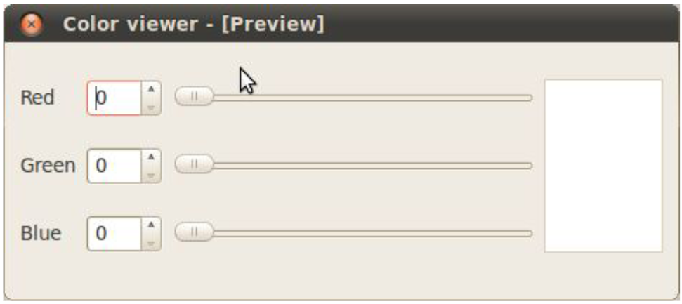
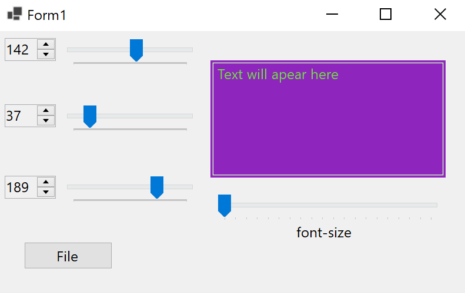
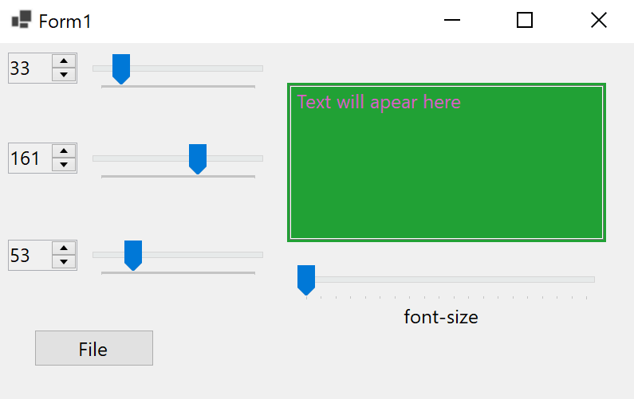
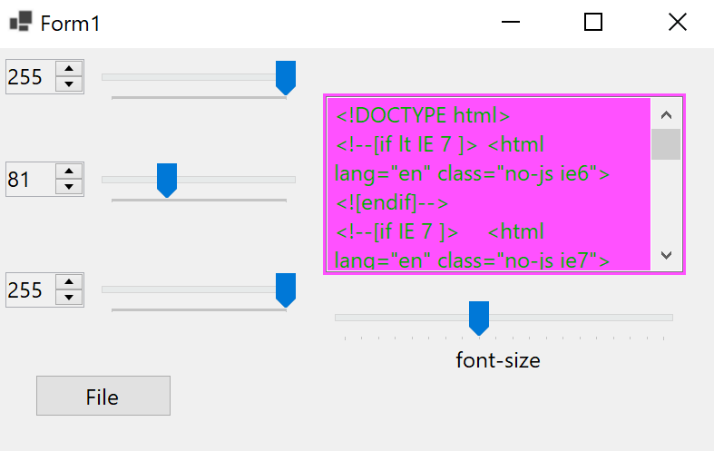

# Отчет по лабораторной работе №1

## Использование библиотеки элементов графического интерфейса 

## Вариант №9

`Кухарев Дмитрий Николаевич (ПО-9)`

## Цель работы

Научиться использовать библиотеку элементов графического интерфейса.

## Задание *(4 балла)*

* пользуясь примером в каталоге lab08/02, создайте приложение с графическим интерфейсом, аналогичным представленному 

## Знакомство с элементами интерфейса: добавим функциональность. *(3 балла)*

* Добавим функциональность созданному на предыдущем этапе приложению:

  * спин-боксы и слайдеры будут перемещаться синхронизировано в диапазоне значений от 0 до 255.

  * Цвет фона панели будет меняться соответственно

* Выполнение:

  * Выставляем диапазон допустимых значений для слайдеров и спин-боксов при помощи методов Minimum и Maximum

  * запрещаем ввод в текстовое поле: ReadOnly = true

  * Реализуем метод установки цвета и изменения слайдеров

  * соединяем изменения слайдеров и спин-боксов

  * в реализации слотов синхронизируем значения слайдера и спин-бокса и вызываем метод для изменения цвета

## Пример работы

## Диалоги *(3 балла)*

Библиотека графических элементов предлагает набор из нескольких полнофункциональных диалоговых окон, позволяющих выполнять некоторые стандартные операции. Среди них такие, как выбор файла в файловой системе, выбор шрифта, выбор цвета, диалог печати и некоторые другие. Мы рассмотрим в настоящей работе пример использования диалога выбора файла.

**Создаём простейший обозреватель текстовых файлов.**

* Создайте новый виджет TextBox.

* Добавьте кнопку и подключите её к openFile

* Открыть файл (можно по имени) и открыть его содержимое в TextBox

## Пример работы

## Код программы

Код программы находится в [Form1.cs](./src/Form1.cs).

Остальные файлы созданы с помощью WinForms
