# Отчет по лабораторной работе №2

## Основы фреймворков для создания пользовательского графического интерфейса

## Вариант №9

`Кухарев Дмитрий Николаевич (ПО-9)`

## Цель работы

Понимание структуры приложения на WinForms и получение опыта использования стандартной документации WinForms.

## Задание 

Разработка законченного оконного приложения — текстового редактора, работающего с несколькими документами с возможностями открытия и сохранения, отмены действий, работы с буфером обмена и другими.

* 1.Интерфейс
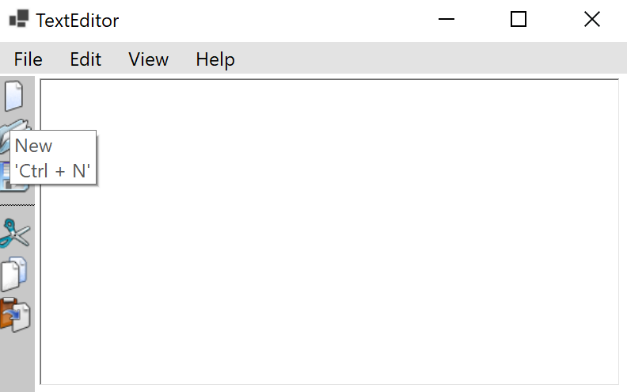

* 2.Открытие файла (производится кнопкой в боковом меню, комбинацией клавиш (см. пункт №.Помощь) или в меню File). Далее способ выполнения действия будет опущен, так как для каждого действия существует комбинация клавиш и/или кнопка. Также если файл не пуст, при действии заменяющем его будет вызвано предупреждение.
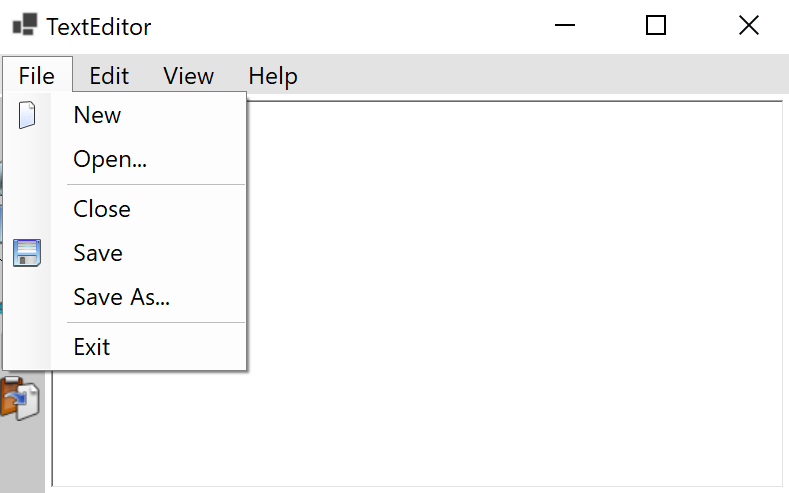
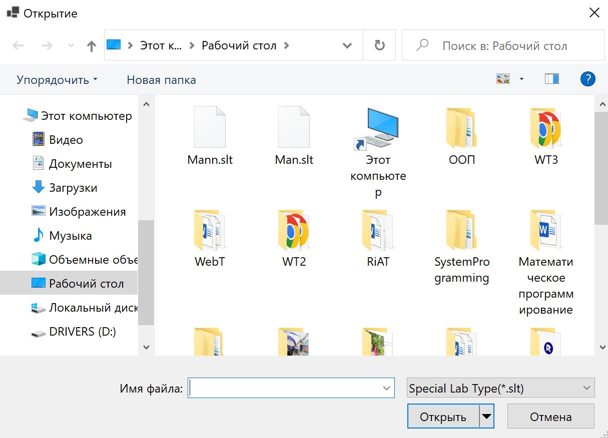
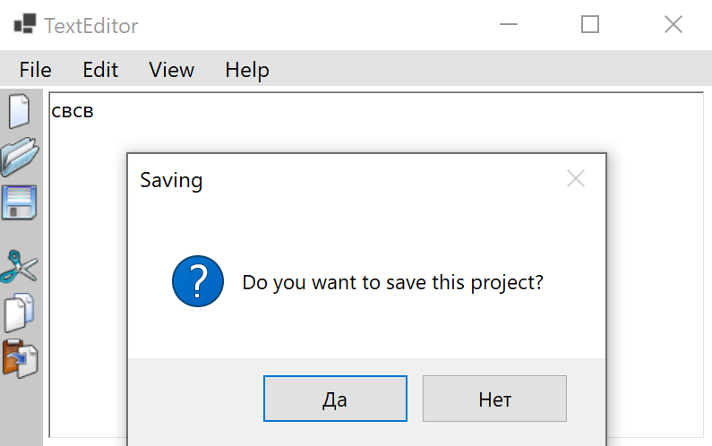

* 3.Сохранение. Есть два варианта:
* 1) Файл ещё не сохранялся, нужно создать (Save As).
* 2) Файл уже существует, можно сохранить только изменения без выбора имени (Save).

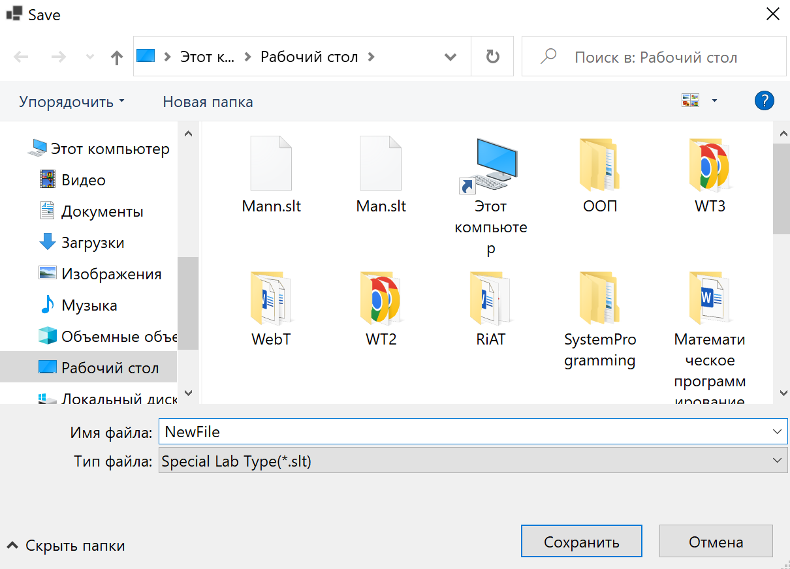

* 4.Вырезать, копировать и вставить. При копировании и вырезании, если не выбрана область выделения, будет скопировано/вырезано все содержимое файла. 

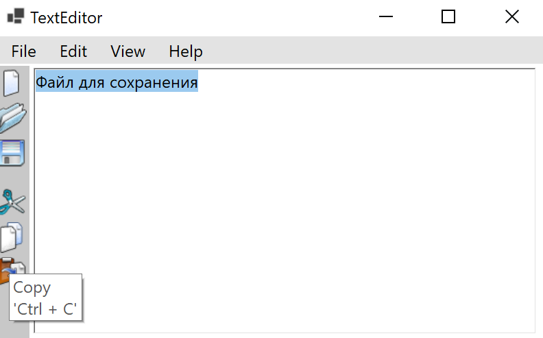
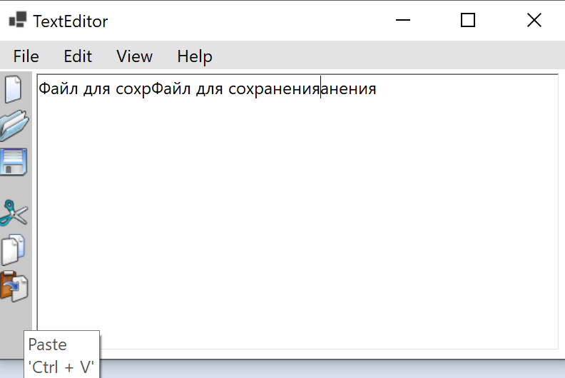

* 5.Выбор стиля. По нажатию на кнопку Edit появляется возможность изменения стиля выделенного или вводимого далее текста.

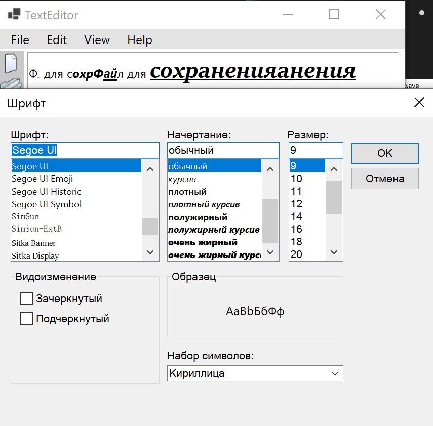

* 6.Помощь. Help содержит все "Горячие клавиши", чтобы пользователь не лазил по программе в поисках нужного действия. Очень удобно👍

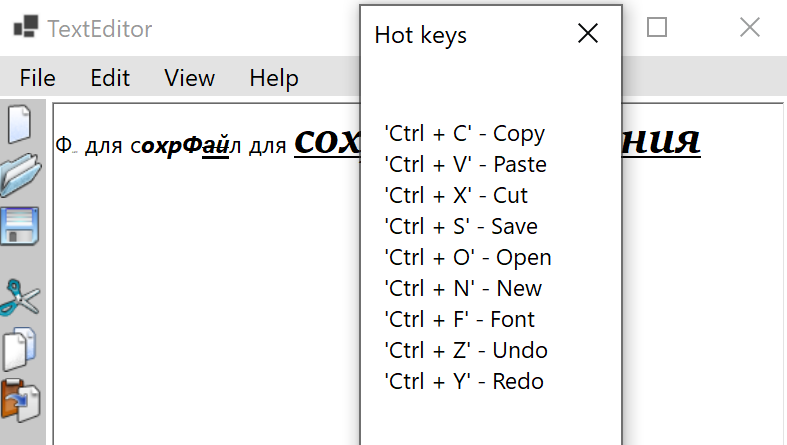

* 7.Выход из программы. Может осуществляться кнопкой-крестиком в правом верхнем углу или же через меню File.

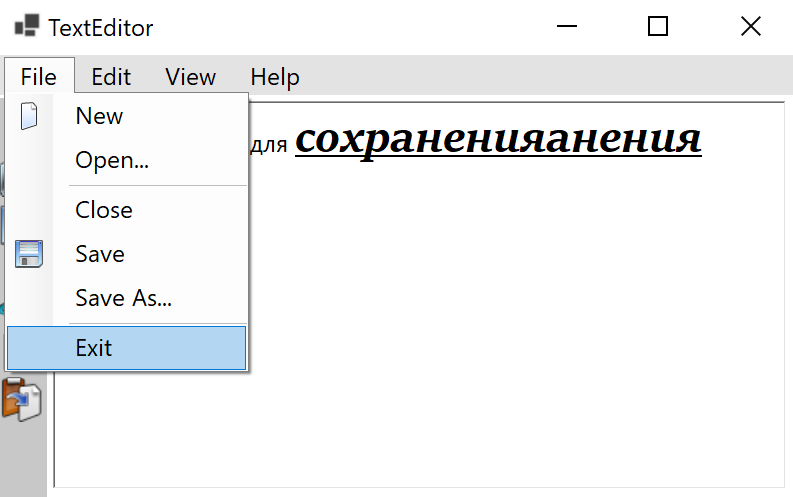
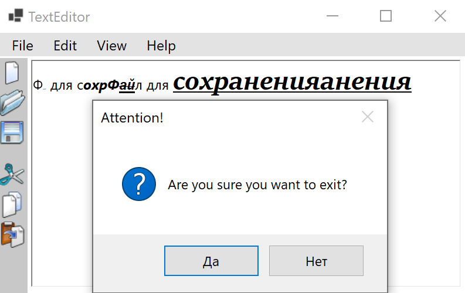

## Код программы

Код программы находится в [Form1.cs](./src/Form1.cs).

Остальные файлы созданы с помощью WinForms

## Вывод

Поняли структуру приложения на WinForms и получили опыт использования стандартной документации WinForms.
