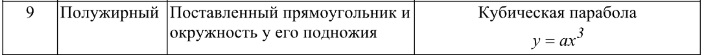

# Отчет по лабораторной работе №7

## Графические примитивы в библиотеке для создания приложений с GUI.

## Вариант №9

`Кухарев Дмитрий Николаевич (ПО-9)`

## Цель работы

Изучить графические примитивы при создании приложений с GUI.

## Задание 

1. Вывести заданным шрифтом вертикально на экран наименование лабораторной работы.

2. Нарисовать цветную фигуру (2 балла) и организовать движение её по заданной
траектории (6 баллов).

## Код программы

Код первого задания находится в [Form1.cs](./src/Task1/Form1.cs).

Код второго задания находится в [Form1.cs](./src/Task2/Form1.cs).

Остальные файлы созданы с помощью WinForms

## Вывод

Изучили графические примитивы при создании приложений с GUI.
