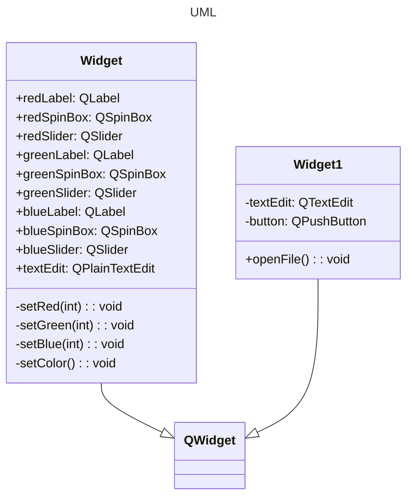

# Лабораторная работа № 6 #

## UML - диаграммы ##

## Вариант 12 ##

```mermaid
---
title: UML
---
classDiagram
  class Widget {
    +redLabel: QLabel
    +redSpinBox: QSpinBox
    +redSlider: QSlider
    +greenLabel: QLabel
    +greenSpinBox: QSpinBox
    +greenSlider: QSlider
    +blueLabel: QLabel
    +blueSpinBox: QSpinBox
    +blueSlider: QSlider
    +textEdit: QPlainTextEdit
    -setRed(int): void
    -setGreen(int): void
    -setBlue(int): void
    -setColor(): void
  }

  class Widget1 {
    -textEdit: QTextEdit
    -button: QPushButton
    +openFile(): void
  }

  Widget --|> QWidget
  Widget1 --|> QWidget

```
