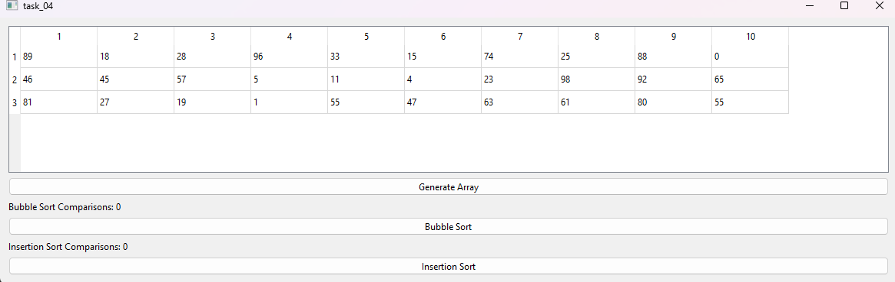
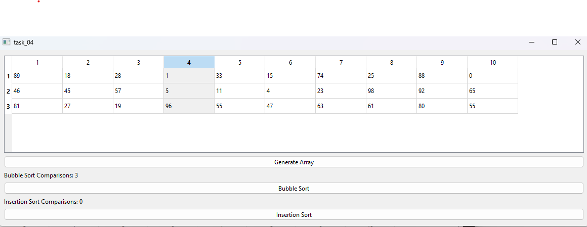
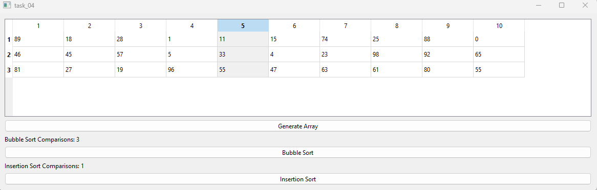

# Лабораторная работа №4

## Создание интерфейса простых приложений

## Вариант 14

## Цель лабораторной работы.

Отработка умений и навыков описания событий в приложениях.

## Задание №2

Напишите программу, выполняющую сортировку случайным образом полученного массива 3х10 методами пузырька и вставок. Создайте интерфейс программы: в таблице 3х10 числа получить случайным образом по сигналу от предусмотренной кнопки; обеспечить выбор метода сортировки; сортировку чисел в столбце начинать по клику ЛКМ в этом столбце; предусмотреть вывод количества сравнений.

## Демонстрация работы приложения

Исходная заполненная таблица:

