# Отчет по лабораторной работе №3

## Контейнеры в Qt5

## Вариант №15

### Задание №1

> \[!NOTE]
> Был выбран **вариант №5**. Так как в списке всего 10 вариантов,
> находим `15 % 10 = 5`

Заменить наибольшее из трех чисел (числа вводятся в lineedit)
разностью двух других чисел и вывести результат в label.

### Задание №2

> \[!NOTE]
> Был выбран **вариант №5**. Так как в списке всего 5 вариантов,
> находим `15 % 5 = 0`

Реализовать для одномерных массивов консольный вариант приложения,
для двумерных – с (консольным)графическим интерфейсом.
В консольном приложении значения элементов массива вводятся пользователем,
в графическом – задаются произвольно.

1. Дан целочисленный массив размера N. Вывести вначале все его четные элементы,
а затем − нечетные, сохраняя порядок следования элементов.

2. Дана матрица размера m x n. Преобразовать матрицу, поменяв местами
минимальный и максимальный элемент в каждой строке.

### Задание №3

> \[!NOTE]
> Был выбран **вариант №5**. Так как в списке всего 5 вариантов,
> находим `15 % 5 = 0`

Для работы со связным списком реализовать консольное приложение, со списком –
использовать консольный(графический) интерфейс. Перебор элементов осуществлять с
помощью итераторов.

1. Заполнить 2 списка случайными элементами и заменить все положительные
элементы первого списка на значение минимального из второго списка.

2. Заполнить связный список случайными элементами. Удалить из списка все
элементы, длина которых больше k.

### Задание №4

> \[!NOTE]
> Был выбран **вариант №5**. Так как в списке всего 5 вариантов,
> находим `15 % 5 = 0`

1. Сформировать стек из 5 чисел. Поменять местами максимальный и минимальный
элементы стека.

2. Заполнить очередь 8 случайными числами из интервала \[0; 50]. Заменить все
четные числа их средним арифметическим значением.

### Задание №5

> \[!NOTE]
> Был выбран **вариант №5**. Так как в списке всего 5 вариантов,
> находим `15 % 5 = 0`

В озере водится несколько видов рыб. Три рыбака поймали рыб, представляющих
некоторые из имеющихся видов. Определить, какие виды рыб есть у каждого рыбака,
какие рыбы есть в озере, но нет ни у одного из рыбаков.

### Задание №6

> \[!NOTE]
> Был выбран **вариант №5**. Так как в списке всего 5 вариантов,
> находим `15 % 5 = 0`

Дан файл f, компоненты которого являются целыми числами. Запишите в файл g все
чётные числа файла f, а в файл h - все нечётные. Порядок следования чисел сохранить.

## Код программы

* [main.cpp](./src/main.cpp)
* [t1.cpp](./src/t1.cpp)
* [t1.h](./src/t1.h)
* [t2.cpp](./src/t2.cpp)
* [t2.h](./src/t2.h)
* [t3.cpp](./src/t3.cpp)
* [t3.h](./src/t3.h)
* [t4.cpp](./src/t4.cpp)
* [t4.h](./src/t4.h)
* [t5.cpp](./src/t5.cpp)
* [t5.h](./src/t5.h)
* [t6.cpp](./src/t6.cpp)
* [t6.h](./src/t6.h)

А также файлы форм

* [t1.ui](./src/t1.ui)
* [t2.ui](./src/t2.ui)
* [t3.ui](./src/t3.ui)
* [t4.ui](./src/t4.ui)
* [t5.ui](./src/t5.ui)
* [t6.ui](./src/t6.ui)

## Пример работы программы

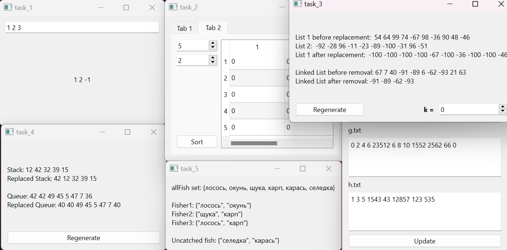

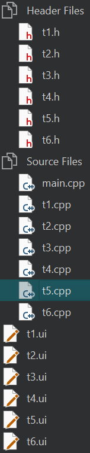

### Пример задания №1

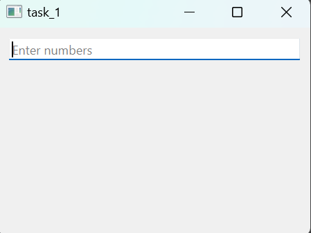

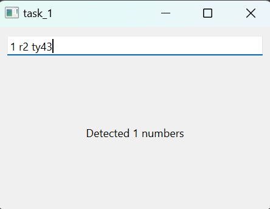

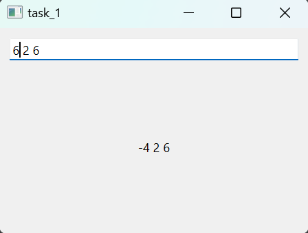

### Пример задания №2

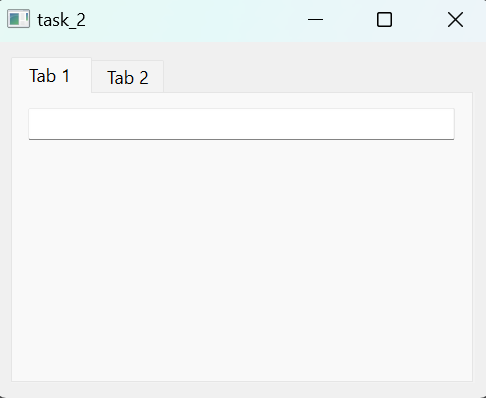

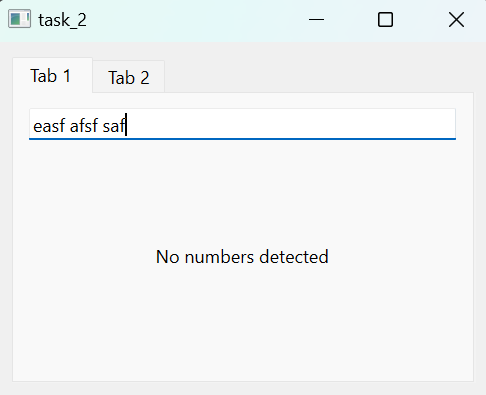

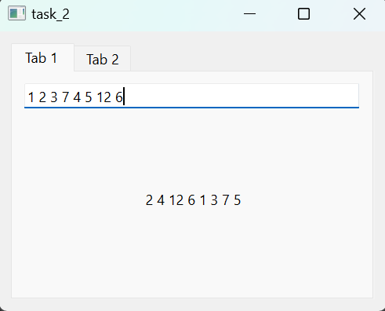

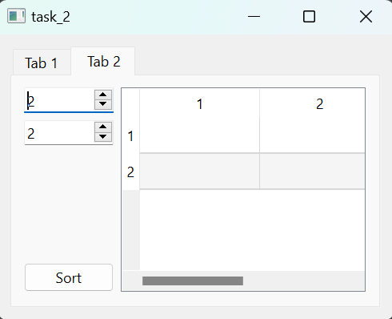

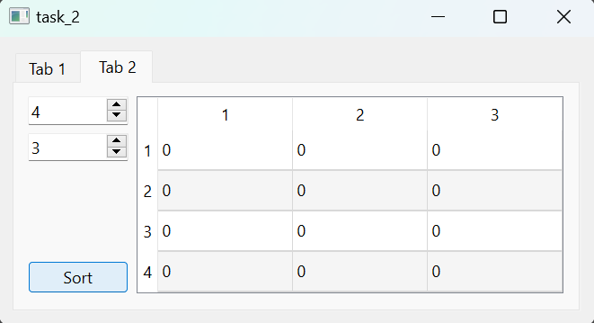

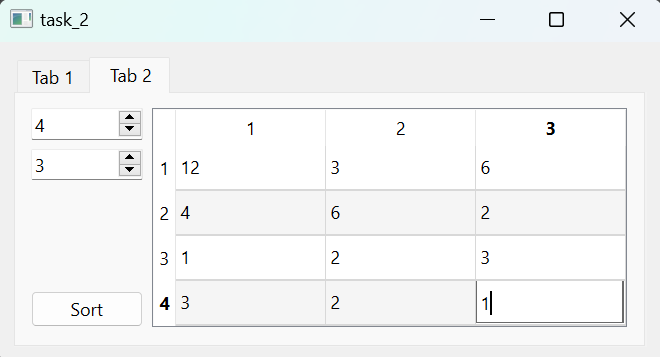

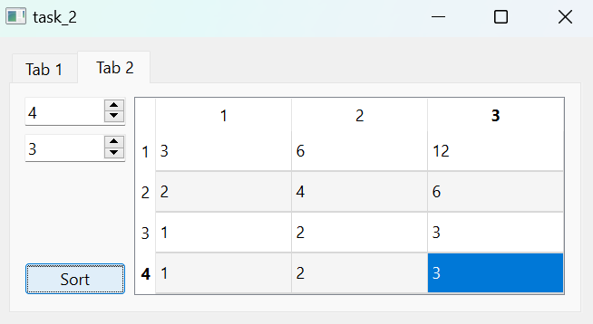

### Пример задания №3

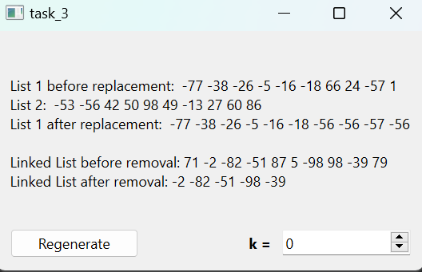

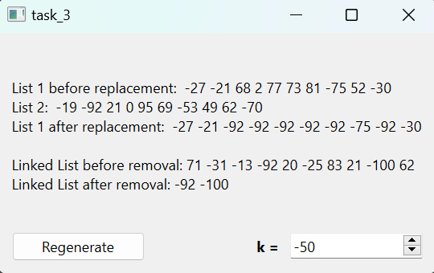

### Пример задания №4

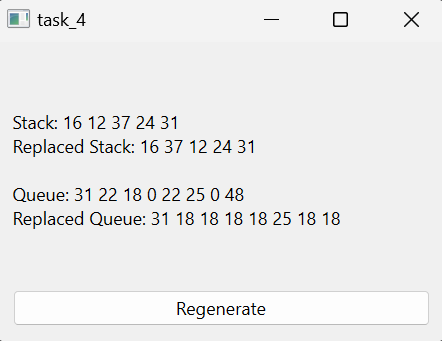

### Пример задания №5

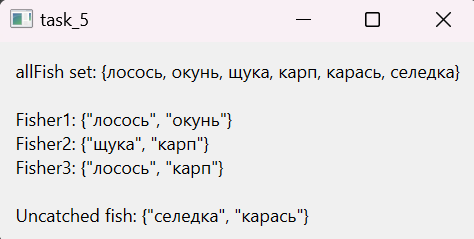

### Пример задания №6

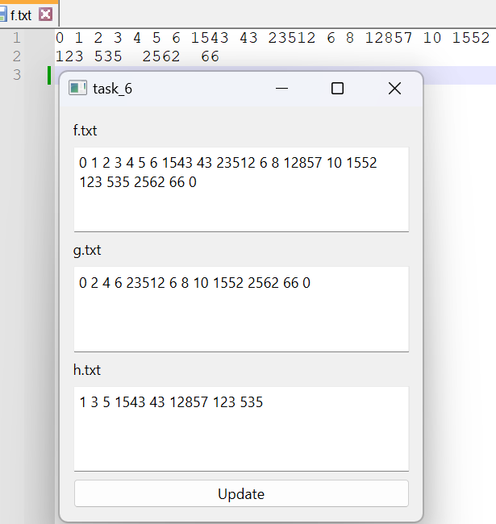
