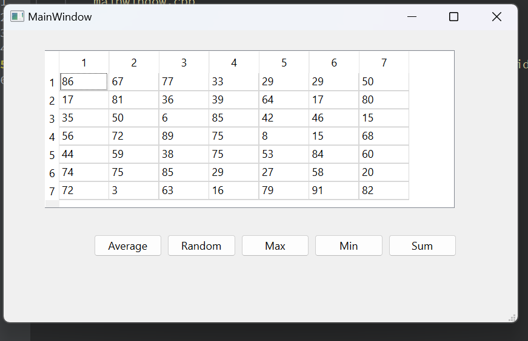
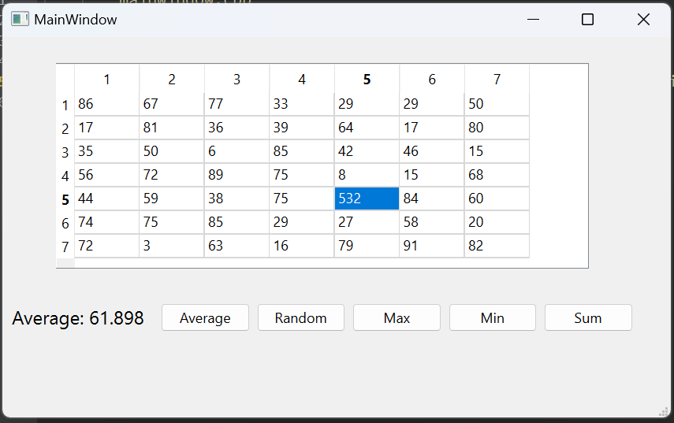
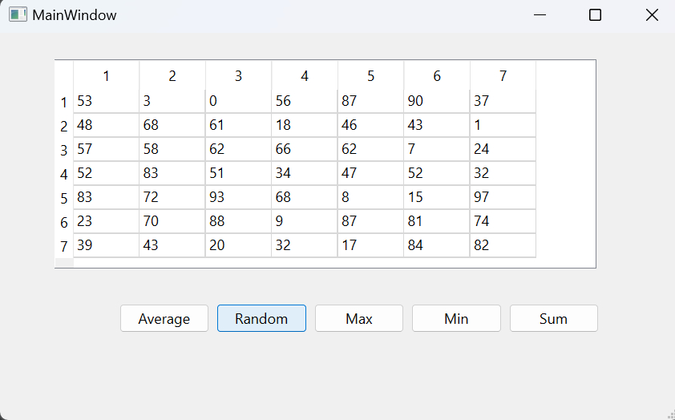
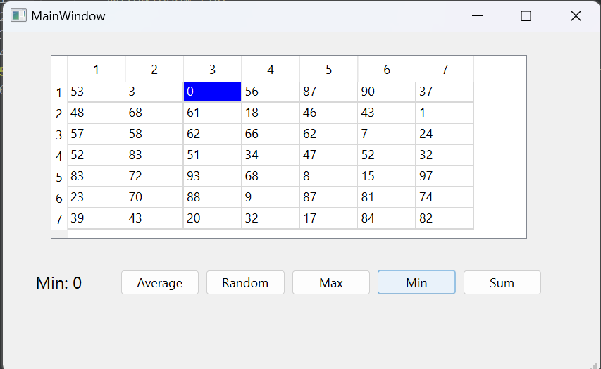
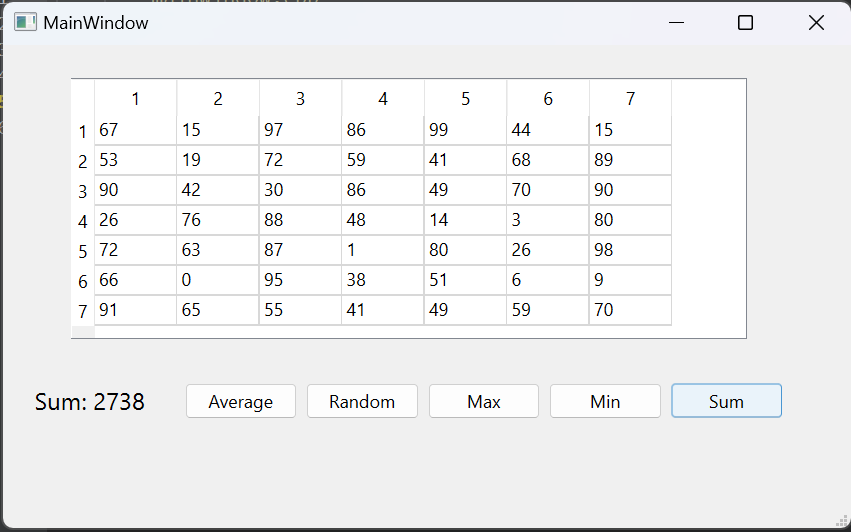

# Отчет по лабораторной работе №4

## Создание интерфейса простых приложений

## Вариант №15

> \[!NOTE]
> Был выбран **вариант №3**. Так как в таблице всего 12 вариантов, находим `15 % 12 = 3`

Напишите программу, способную определять следующие параметры массива 7х7: максимальное и минимальное значение, их местоположение, сумму значений элементов массива и среднее арифметическое значение. Создайте интерфейс программы: в таблице 7х7 числа получить случайным образом по сигналу от предусмотренной кнопки; кнопки «Max» и «Min» должны выполнять поиск соответствующих значений и их местоположение, которое должно быть подсвечено цветом в таблице; кнопки «Сумма» и «СА» должны высчитывать указанные значения и выводить результат в поля надписи.

## Код программы

* [main.cpp](./src/main.cpp)
* [mainwindow.cpp](./src/mainwindow.cpp)
* [mainwindow.h](./src/mainwindow.h)

А также файл формы

* [mainwindow.ui](./src/mainwindow.ui)

## Пример работы программы

QTable:

Подсчет среднего + редактирование ячейки:

Рандомизатор таблицы

Поиск максимального в таблице

Поиск минимального в таблице

Подсчет суммы:

