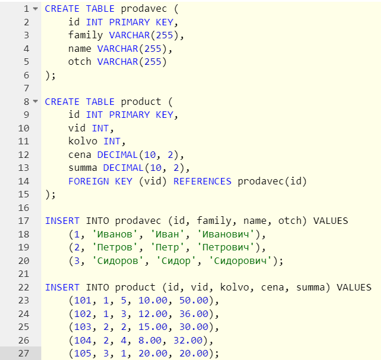
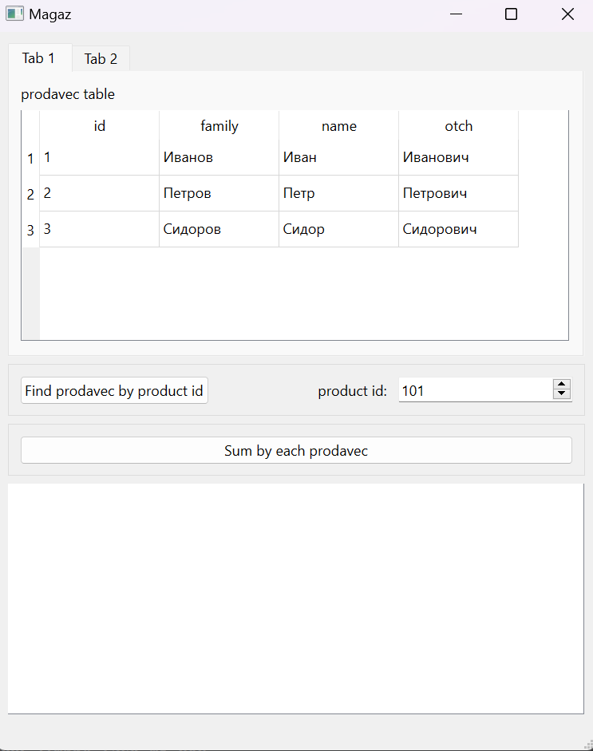
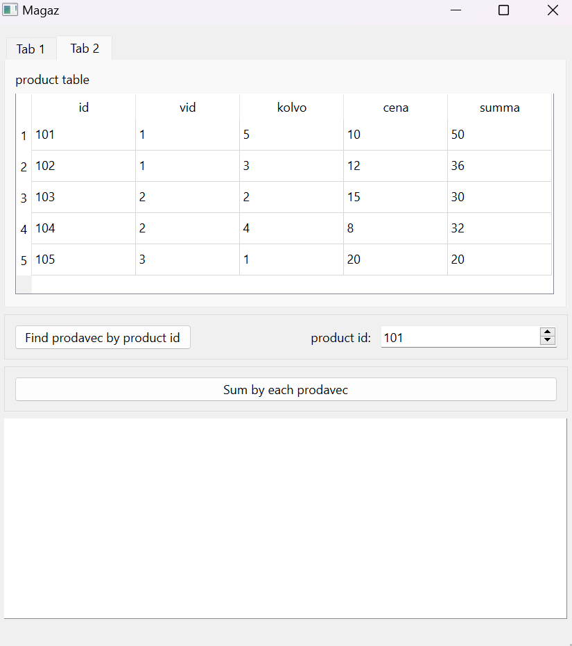
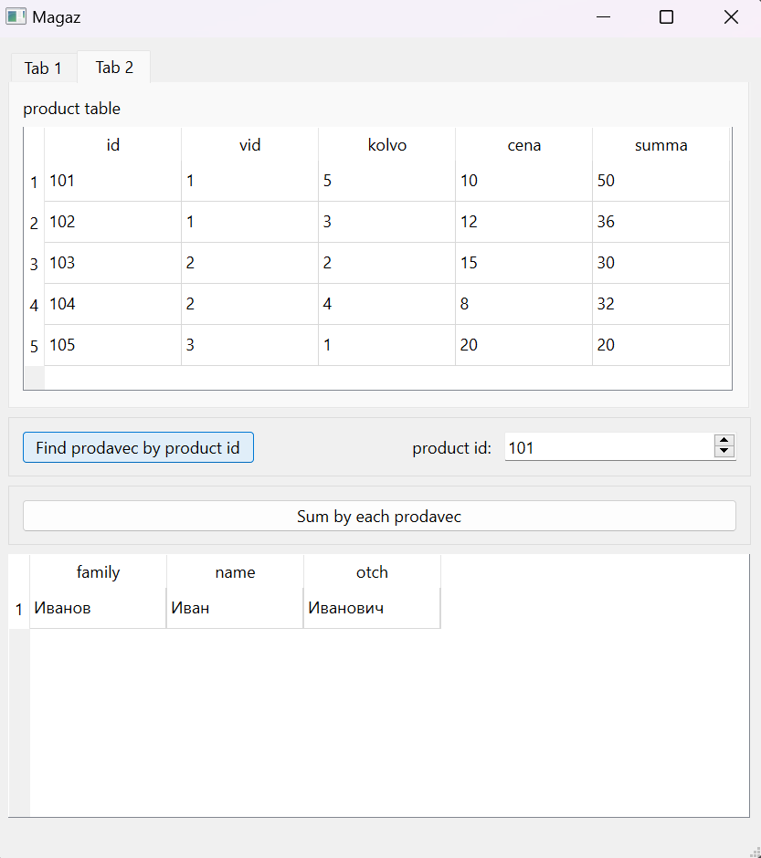
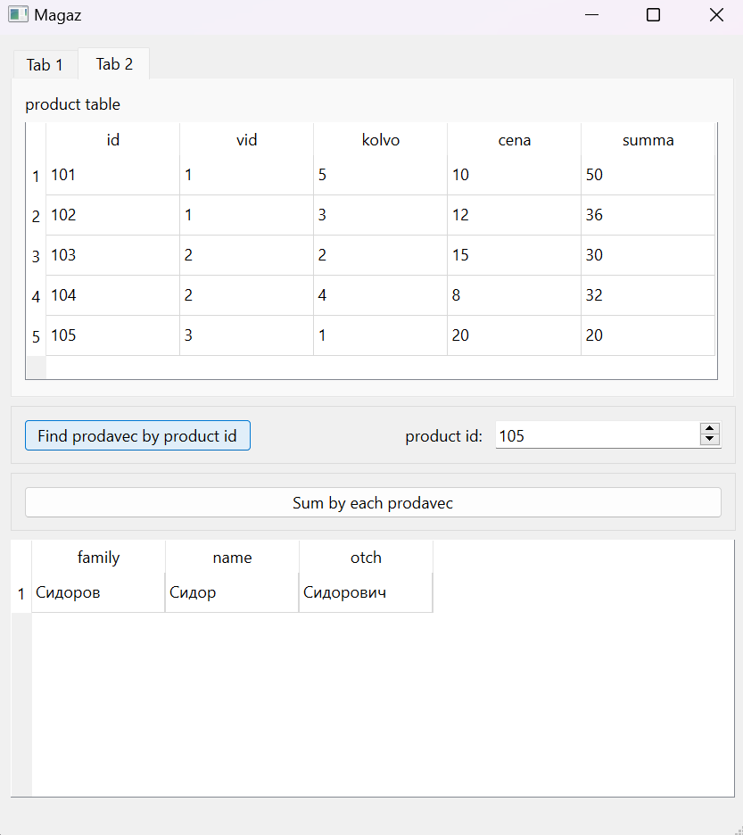

# Отчет по лабораторной работе №5

## Создание приложений баз данных

## Вариант №15

> \[!NOTE]
> Был выбран **вариант №3**. Так как в таблице всего 12 вариантов, находим
> `15 % 12 = 3`

Средствами IDE Qt designer создать интерфейс программы, осуществляющей подключение
к базе данных SQLite. С помощью программы SQLiteManager создать необходимые таблицы
в файле базы данных. Наполнение таблиц осуществлять из созданной программы.

Напишите программу «Учет продукции». В программе использовать две таблицы:
prodavec (поля id, family, name, otch) и product (поля id, vid, kolvo, cena, summa).
Создать запросы: определение Ф.И.О. продавцов по товару (vid); определение вырученной
суммы по каждому продавцу.

## Код программы

* [main.cpp](./src/main.cpp)
* [mainwindow.cpp](./src/mainwindow.cpp)
* [mainwindow.h](./src/mainwindow.h)

А также файл формы

* [mainwindow.ui](./src/mainwindow.ui)

## Пример работы программы

