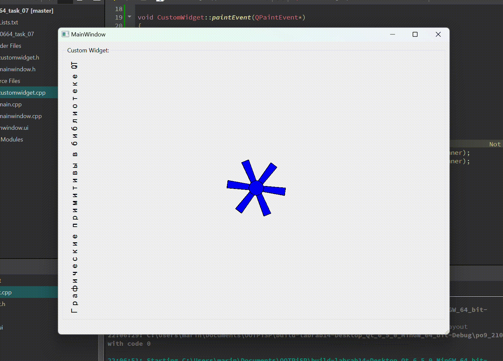

# Отчет по лабораторной работе №7

## Графические примитивы в библиотеке QT

## Вариант №15

> \[!NOTE]
> Был выбран **вариант №1**. Так как в таблице всего 14 вариантов, находим
> `15 % 14 = 1`

1. Вывести заданным шрифтом вертикально на экран наименование лабораторной
работы – 2 балла.  
2. Нарисовать цветную фигуру (2 балла) и организовать движение её по заданной траектории
(6 баллов).

|№ варианта|Шрифт|Фигура|Траектория движения|
| :-: | :-: | :-: | :-: |
|1|Готический|Снежинка, имеющая сердцевину в виде окружности|Раскручивающаяся спираль|

## Код программы

- [customwidget.h](./src/customwidget.h)
- [customwidget.cpp](./src/customwidget.cpp)

Остальные файлы проекта вспомогательные.

## Пример работы программы

