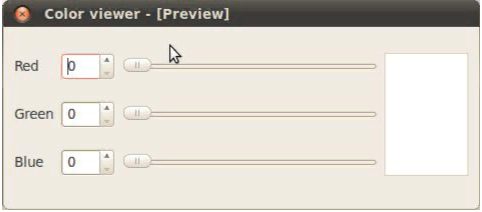
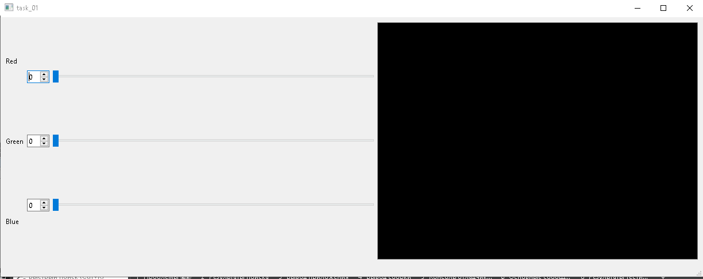
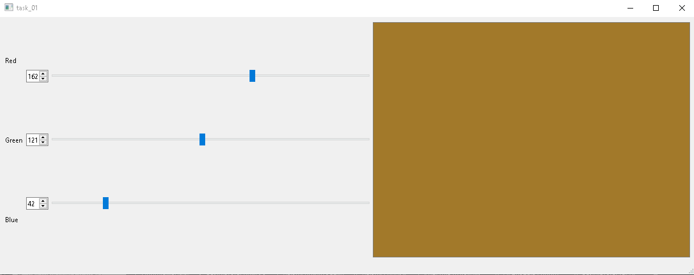
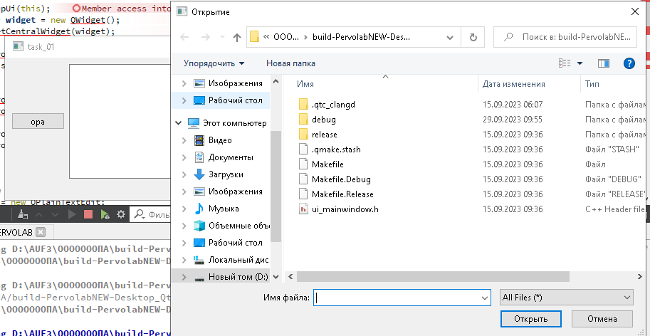
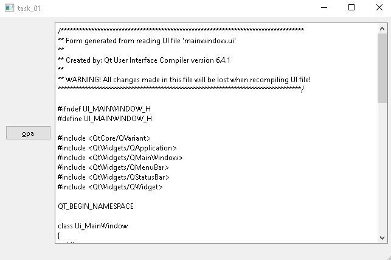

# Лабораторная работа №1 #

## «Использование библиотеки элементов графического интерфейса Qt» ##

## Задание (4 балла) ##

- пользуясь примером в каталоге lab08/02, создайте приложение с графическим
нтерфейсом, аналогичным представленному сверху
- используйте классы `QLabel, QSpinBox, QSlider, QPlainTextEdit`.



## Знакомство с элементами интерфейса: добавим функциональность. (3 балла) ##

- Добавим функциональность созданному на предыдущем этапе приложению:
  - спин-боксы и слайдеры будут перемещаться синхронизировано в диапазоне
  значений от 0 до 255.
  - Цвет фона QPlainTextEdit будет меняться соответственно
- Выполнение:
  - Выставляем диапазон допустимых значений для QSpinBox и QSlider при помощи
  методов setMinimum() и setMaximum()
  - запрещаем ввод в текстовое поле: setEnabled(false)
  - Реализуем метод setColor() и слоты setRed(int), setGreen(int), setBlue(int)
  - к слотам подключаем сигналы QSlider::sliderMoved() и QSpinBox::valueChanged()
  - в реализации слотов синхронизируем значения слайдера и спин-бокса и
  вызываем setColor()
- Для изменения цвета фона текстового поля воспользуемся таблицами стилей для
описания стиля элементов.
  - таблицы стилей используют синтаксис CSS
  - будем задавать цвет в виде строки типа #rrggbb
  - таким образом, надо задать QPlainTextEdit следующий стиль:
  - QPlainTextEdit { background: #rrggbb; }
  - задаём стиль при помощи метода setStyleSheet() (таблица стиля передаётся
  в виде строки).

## Диалоги (3 балла) ##

Библиотека графических элементов Qt предлагает набор из нескольких
полнофункциональных диалоговых окон, позволяющих выполнять некоторые
стандартные операции. Среди них такие, как выбор файла в файловой системе,
выбор шрифта, выбор цвета, диалог печати и некоторые другие.
Мы рассмотрим в настоящей работе пример использования диалога выбора файла - QFileDialog.

- Создаём простейший обозреватель текстовых файлов.
- Создайте новый виджет и поместите на него элемент QTextEdit.
- Добавьте кнопку QPushButton и подключите её сигнал clicked() к слоту openFile()
- Реализуйте в слоте выбор имени файла пользователем: QFileDialog::getOpenFileName()
- Откройте QFile в соответствии с выбранным названием
- Прочитайте его содержимое и поместите в виде текста в элемент QTextEdit

## Выполнение заданий ##

## Mainwindow.h ##

```c++
#ifndef MAINWINDOW_H
#define MAINWINDOW_H

#include <QMainWindow>
#include "QPushButton"
#include "QSpinBox"
#include "QLabel"
#include "QSlider"
#include "QPlainTextEdit"
#include "QTextEdit"
#include "QSize"
#include "QStyle"
#include "QCommonStyle"
#include "QFormLayout"
#include "QPlainTextEdit"

QT_BEGIN_NAMESPACE
namespace Ui { class MainWindow; }
QT_END_NAMESPACE

class MainWindow : public QMainWindow
{
    Q_OBJECT

public:
    MainWindow(QWidget *parent = nullptr);
    ~MainWindow();

    void setColor();

    QSpinBox* sb1;
    QSpinBox* sb2;
    QSpinBox* sb3;

    QSlider* sl1;
    QSlider* sl2;
    QSlider* sl3;

    int r_{0};
    int g_{0};
    int b_{0};

    QPlainTextEdit* txtEdit;

private:
    Ui::MainWindow *ui;

public slots:
    void setRed(int r);
    void setGreen(int g);
    void setBlue(int b);
};
#endif // MAINWINDOW_H
```

## Mainwindow.cpp ##

```c++
#include "mainwindow.h"
#include "ui_mainwindow.h"

MainWindow::MainWindow(QWidget *parent)
    : QMainWindow(parent)
    , ui(new Ui::MainWindow)
{
    ui->setupUi(this);
    QWidget* widget = new QWidget();
    this->setCentralWidget(widget);

    QGridLayout* grid_layout = new QGridLayout;
    widget->setLayout(grid_layout);

    QVBoxLayout* v_box_layout1 = new QVBoxLayout;
    QVBoxLayout* v_box_layout2 = new QVBoxLayout;
    QVBoxLayout* v_box_layout3 = new QVBoxLayout;
    QVBoxLayout* v_box_layout4 = new QVBoxLayout;
    grid_layout->addLayout(v_box_layout1, 0, 0);
    grid_layout->addLayout(v_box_layout2, 0, 1);
    grid_layout->addLayout(v_box_layout3, 0, 2);
    grid_layout->addLayout(v_box_layout4, 0, 3);

    QLabel* sb_label1 = new QLabel;
    QLabel* sb_label2 = new QLabel;
    QLabel* sb_label3 = new QLabel;
    sb_label1->setText("Red");
    sb_label2->setText("Green");
    sb_label3->setText("Blue");
    v_box_layout1->addWidget(sb_label1, Qt::AlignCenter);
    v_box_layout1->addWidget(sb_label2, Qt::AlignCenter);
    v_box_layout1->addWidget(sb_label3, Qt::AlignCenter);

    this->sb1 = new QSpinBox;
    this->sb2 = new QSpinBox;
    this->sb3 = new QSpinBox;
    sb1->setMaximum(255);
    sb2->setMaximum(255);
    sb3->setMaximum(255);
    v_box_layout2->addWidget(sb1, Qt::AlignCenter);
    v_box_layout2->addWidget(sb2, Qt::AlignCenter);
    v_box_layout2->addWidget(sb3, Qt::AlignCenter);


    this->sl1 = new QSlider(Qt::Orientation::Horizontal);
    this->sl2 = new QSlider(Qt::Orientation::Horizontal);
    this->sl3 = new QSlider(Qt::Orientation::Horizontal);

    sl1->setMinimumWidth(250);
    sl2->setMinimumWidth(250);
    sl3->setMinimumWidth(250);
    sl1->setMaximum(255);
    sl2->setMaximum(255);
    sl3->setMaximum(255);
    v_box_layout3->addWidget(sl1, Qt::AlignCenter);
    v_box_layout3->addWidget(sl2, Qt::AlignCenter);
    v_box_layout3->addWidget(sl3, Qt::AlignCenter);

    txtEdit = new QPlainTextEdit;
    txtEdit->setReadOnly(true);
    txtEdit->setStyleSheet("background: #000000;");
    v_box_layout4->addWidget(txtEdit);

    this->resize(450, 200);
    this->setWindowTitle("Huiii");

    connect(sl1, &QSlider::valueChanged, this, &MainWindow::setRed);
    connect(sl2, &QSlider::valueChanged, this, &MainWindow::setGreen);
    connect(sl3, &QSlider::valueChanged, this, &MainWindow::setBlue);

    connect(sb1, &QSpinBox::valueChanged, this, &MainWindow::setRed);
    connect(sb2, &QSpinBox::valueChanged, this, &MainWindow::setGreen);
    connect(sb3, &QSpinBox::valueChanged, this, &MainWindow::setBlue);
}

MainWindow::~MainWindow()
{
    delete ui;
}


void MainWindow::setRed(int r){
    this->sb1->setValue(r);
    this->sl1->setValue(r);
    this->r_=r;
    this->setColor();
}
void MainWindow::setGreen(int g){
    this->sb2->setValue(g);
    this->sl2->setValue(g);
    this->g_=g;
    this->setColor();
}
void MainWindow::setBlue(int b){
    this->sb3->setValue(b);
    this->sl3->setValue(b);
    this->b_=b;
    this->setColor();
}
void MainWindow::setColor(){
    this->txtEdit->setStyleSheet(QString("background: rgb(%1, %2, %3)").arg(this->r_).arg(this->g_).arg(this->b_));
}
```

## Результатная программа ##




## Вторая программа ##

## MainWindow.h ##

```c++
#ifndef MAINWINDOW_H
#define MAINWINDOW_H

#include <QMainWindow>
#include "QPushButton"
#include "QSpinBox"
#include "QLabel"
#include "QPlainTextEdit"
#include "QTextEdit"
#include "QSize"
#include "QStyle"
#include "QCommonStyle"
#include "QFormLayout"
#include "QPlainTextEdit"
#include "QFileDialog"
#include "QFile"
#include "QString"
#include "QByteArray"

QT_BEGIN_NAMESPACE
namespace Ui { class MainWindow; }
QT_END_NAMESPACE

class MainWindow : public QMainWindow
{
    Q_OBJECT

public:
    MainWindow(QWidget *parent = nullptr);
    ~MainWindow();
    QPushButton *but;

    QPlainTextEdit* txtEdit;

private:
    Ui::MainWindow *ui;

public slots:
    void Otkr();
};
#endif // MAINWINDOW_H

```

## MainWindow.cpp ##

```c++
#include "mainwindow.h"
#include "ui_mainwindow.h"

MainWindow::MainWindow(QWidget *parent)
    : QMainWindow(parent)
    , ui(new Ui::MainWindow)
{
    ui->setupUi(this);
    QWidget* widget = new QWidget();
    this->setCentralWidget(widget);

    QGridLayout* grid_layout = new QGridLayout;
    widget->setLayout(grid_layout);


    QVBoxLayout* v_box_layout3 = new QVBoxLayout;
    QVBoxLayout* v_box_layout4 = new QVBoxLayout;

    grid_layout->addLayout(v_box_layout3, 0, 2);
    grid_layout->addLayout(v_box_layout4, 0, 3);


    but= new QPushButton("&opa", this);
    txtEdit = new QPlainTextEdit;
    txtEdit->setReadOnly(true);
    v_box_layout3->addWidget(but);
    v_box_layout4->addWidget(txtEdit);

    this->resize(450, 200);
    this->setWindowTitle("Huiii");

    connect(but, &QPushButton::clicked, this, &MainWindow::Otkr);

}
void MainWindow::Otkr(){
    QFileDialog fila(this);
    fila.setFileMode(QFileDialog::AnyFile);
    QStringList fileName;
    if(fila.exec()){
        fileName = fila.selectedFiles();
        qDebug() << fileName[0];
        QFile readFil(fileName[0]);
        if(!readFil.open(QIODevice::ReadOnly))
            return;
        QByteArray data=readFil.readAll();
        txtEdit->setPlainText(QString(data));
    }

}
MainWindow::~MainWindow()
{
    delete ui;
}
```

## Результатная программа 2 ##



