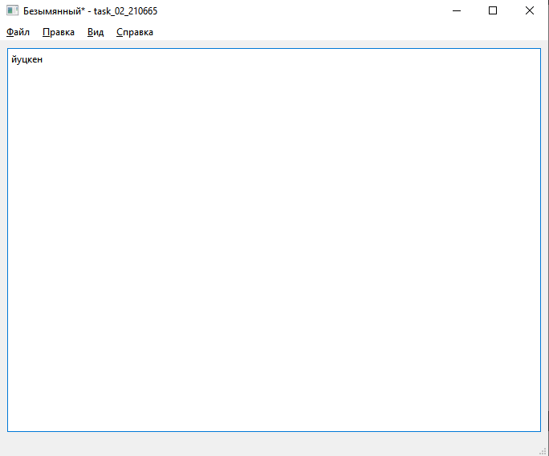
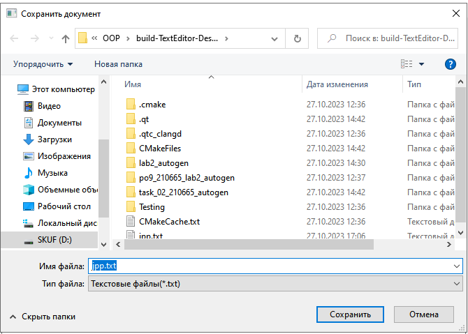
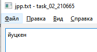
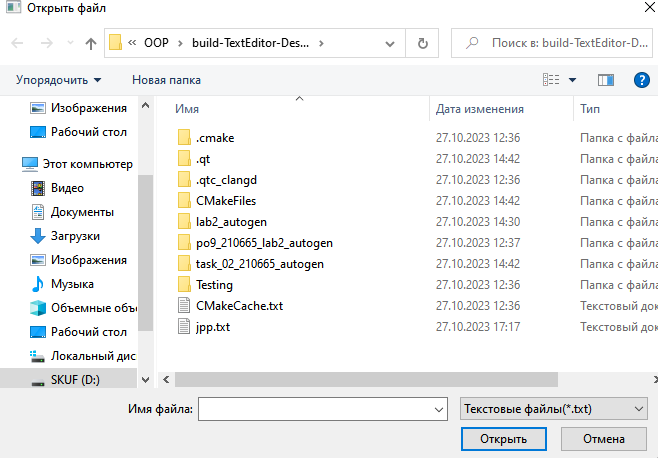
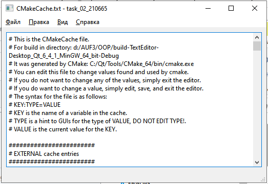
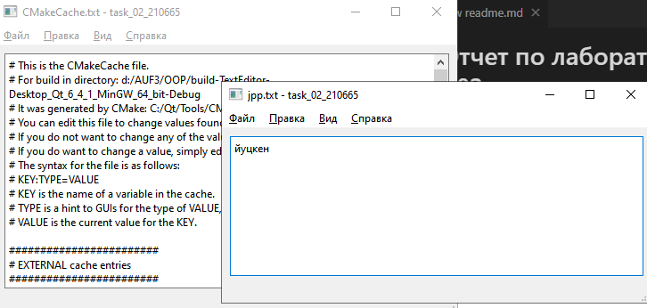
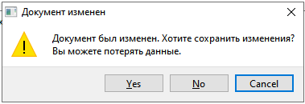

# Лабораторная работа №2 #

## Основы Qt ##

Задание: Нужно реализовать простейший редактор
txt-файлов с минимальным но удобным интерфейсом.

Без открытых файлов имеем безымянный файл, который потом можем сохранить:

Собственно и открыть тоже можно:

Собственно уже есть 2 окна:

О изменениях предупреждает:

Вывод: сигналы, QAction, готовые диалоговые окна -
это прекрасно и хотя бы не пахнет WinAPI.
