# Отчет по лабораторной работе №3

## Контейнеры в Qt5

## Задания для самостоятельного выполнения

Вид меню:

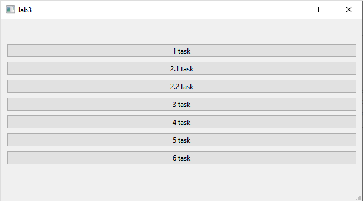

**Задание 1** Самостоятельное решение задач по вариантам. Реализовать
приложения с консольным(графическим) интерфейсом пользователя.

**Вариант 6** Даны две переменные целого типа: A и B
(переменные вводятся в **lineedit**). Если их значения не равны, то присвоить
каждой переменной максимальное из этих значений, а если равны, то присвоить
переменным нулевые значения.

Изначальный вид окна:

Вводим исходные данные:

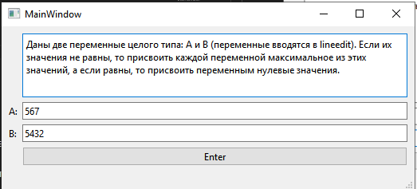

Выполняем:

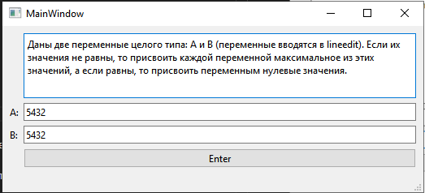

**Задание 2.** Самостоятельное решение задач по вариантам. Реализовать для
одномерных массивов консольный вариант приложения, для двумерных – с
(консольным)графическим интерфейсом. В консольном приложении значения элементов
массива вводятся пользователем, в графическом – задаются произвольно.

Вариант 1

1. Дан массив размера N. Вывести его элементы в обратном порядке.

Вводим исходные данные:

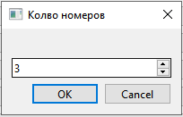
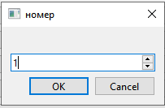
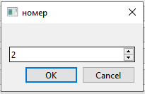
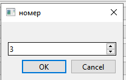

Выполняем:

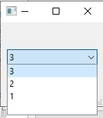

2.Дано число k (0 < k < 11) и матрица размера m x n. Найти сумму и произведение
элементов k-го столбца данной матрицы (нахождение суммы или произведения
определяется пользователем в виджете comboBox).

Изначальный вид окна:

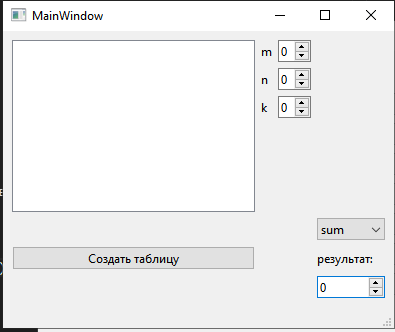

Вводим исходные данные:

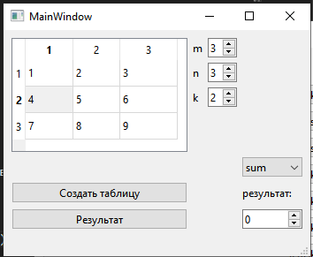
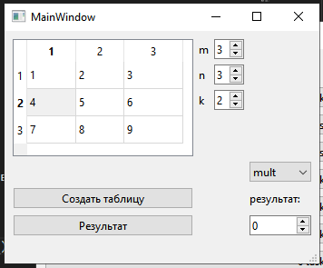

Выполняем:

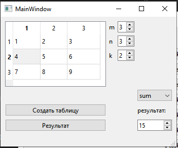

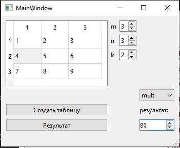

**Задание 3** Самостоятельное решение задач по вариантам. Для работы со связным
списком реализовать консольное приложение, со списком – использовать
консольный(графический) интерфейс. Перебор элементов осуществлять с помощью итераторов.

Вариант 1

1. Заполнить список случайными элементами. Реализовать добавление элемента в
конец списка и удаления с конца (использовать RadioButton для выбора действия).

2. Создать два связных списка. Скопировать элементы первого во второй.

Изначальный вид окна:

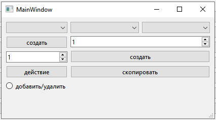

кнопки говорят сами за себя

в спинбоксах указывается длина будущего списка

**Задание 4** Самостоятельное решение задач по вариантам. Реализовать приложения
с консольным(графическим ) интерфейсом.

Вариант 1

1. Заполнить стек 10 случайными числами из интервала \[-10; 20]. Просмотреть
содержимое стека. Найти сумму положительных чисел, хранящихся в стеке.

2. Сформировать очередь из 8 чисел. Записать в очередь модуль разности между
двумя соседними элементами очереди.

Вид окна после нажатия на кнопки:

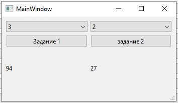

снизу в label ответ на задание

**Задание 5.** Самостоятельное решение задач по вариантам. Реализовать
приложения с консольным (графическим) интерфейсом.

**Вариант 1** Имеется список класса (все имена различны). Определить, есть ли в
классе человек, который побывал в гостях у всех. (Для каждого ученика составить
множество побывавших у него в гостях друзей, сам ученик в это множество не входит.)

Приход гостей рандомный, во 2-ом комбобксе смотрим для каждого
его гостей:

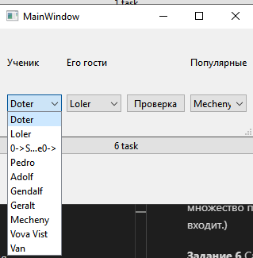

В третьем комбобоксе будут посещенные всем классом

**Задание 6** Самостоятельное решение задач по вариантам. Реализовать приложения
с консольным (графическим) интерфейсом.

**Вариант 1** Дан файл f, компоненты которого являются действительными числами. Найдите:

а) наибольший компонент;

б) наименьший компонент с четным номером;

в) наибольший модуль компонента с нечётным номером;

г) разность первого и последнего компонента файла.

Вид окна вначале + диалог для файла:

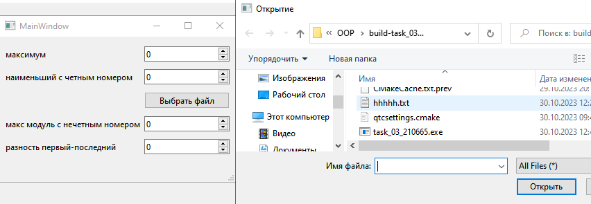

В файле данные: 34 67 78 56 78 0 67 45 34 90

Вывод:

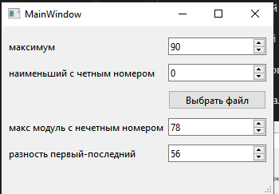

Вывод по лабораторной: контейнеры Qt удобнее чем STL, сказано, что они медленне,
но удобство использования их функциональности для меня важнее.
