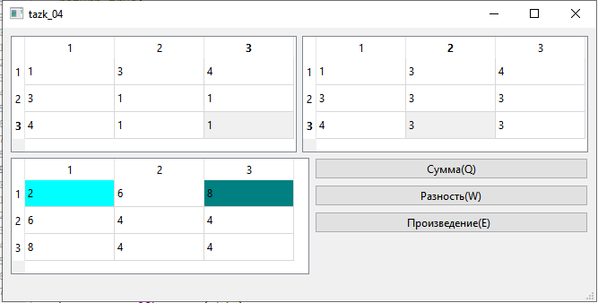
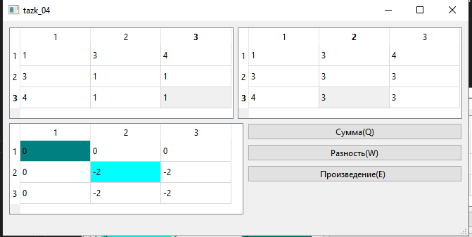
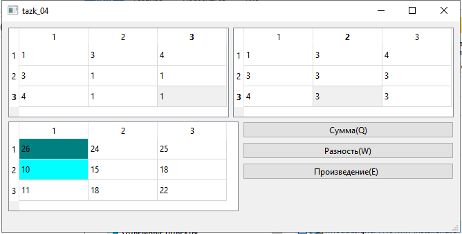

# Лабораторная работа №4 #

## Цель лабораторной работы ##

Отработка умений и навыков описания событий в приложениях.

## Задание ##

|Вариант|Задание|
| --- | --- |
| 4 | Напишите программу, выполняющую операции сложения, вычитания и умножения
матриц 3х3. Создайте интерфейс программы: в 2-х таблицах 3х3 числа получить
случайным образом по сигналу от предусмотренной кнопки; кнопки «Сумма»,
«Разность» и «Произведение» должны выполнять соответствующие действия над
массивами, результат должен быть выведен в третий массив, в котором подсветить
цветом максимальное и минимальное значение. |

Результат:

Сумма:

Разность:

Произведение:

