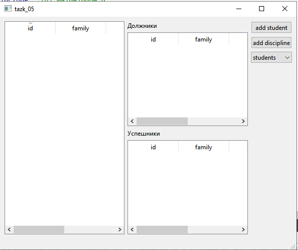
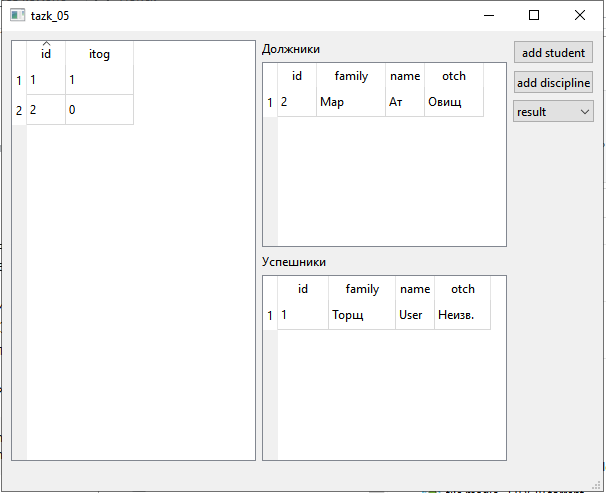

# Лабораторная работа №5 #

## Создание приложений баз данных ##

### Цель работы ###

Отработка умений и навыков создания интерфейса баз данных.

### Задание ###

Средствами IDE Qt designer
создать интерфейс программы, осуществляющей подключение к базе данных SQLite.
С помощью программы SQLiteManager создать необходимые таблицы
в файле базы данных. Наполнение таблиц осуществлять из созданной
программы. Параметры подключения узнать у преподавателя.

### Вариант 4 ###

Напишите программу «Учет успеваемости». В программе
использовать три
таблицы: student (поля ***id, family, name, otch***), session
(поля ***diss, vid***) и result (поля ***id, itog***). Создать запросы:
создать список успешно сдавших сессию, создать список задолжников.|

Результат:

Изначально имеем:

добавим студентов с разными результатами и видим:

