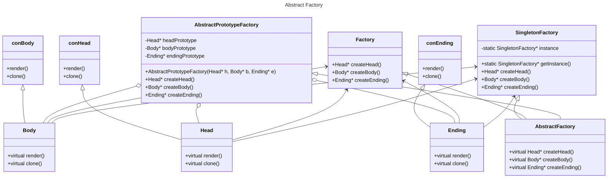

# Лабораторная работа № 6 #

## UML - диаграммы ##

## Цель работы ##

Осознать эти диаграммы хоть немного, а ото ведь позорник и не
разбираюсь совсем.

## Задания для выполнения ##

Задание UML для лабораторной по паттернам.

В диаграмме описываются связи между классами
фабрик, частей, наследования....

Диаграмма как есть, но Mermaid:

## Вывод ##

Я разобрался c UML и осознав, что всякая программа требует документации, принял mermaid.
