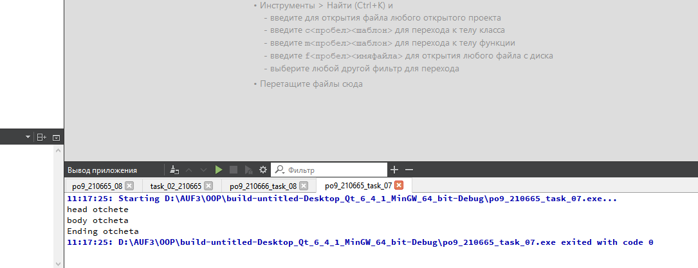

# Лабораторная работа №7

## Паттерны проектирования

## Вариант 16

## Цель лабораторной работы

Отработка умений и навыков применения паттернов проектирования.

## Задание №1

- Применить паттерн абстрактная фабрика при построении интерфейса пользователя.
  Продукты фабрики: список, поле ввода, кнопка, язык отображения.
  
  Применить паттерн проектирования “Prototype” совместно с абстрактной фабрикой,
  то есть внести изменения в проект “Порождающие паттерны.
  Абстрактная фабрика”, чтобы абстрактная фабрика параметризировалась прототипами.

  Применить паттерн проектирования  “Singleton” совместно с абстрактной фабрикой.

- Применить паттерн “Строитель” для построения Отчета по частям.
  
  Части: Head, Body, Ending.
  
  ConcreteBuilder выбрать самостоятельно

  Применить паттерн  “Фабричный метод” при создании конкретного строителя
  и передачи его клиенту.

В итоге у нас:

