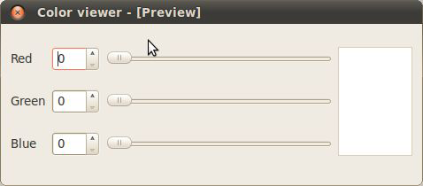
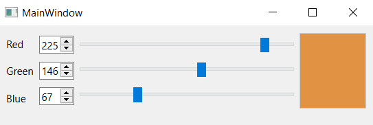
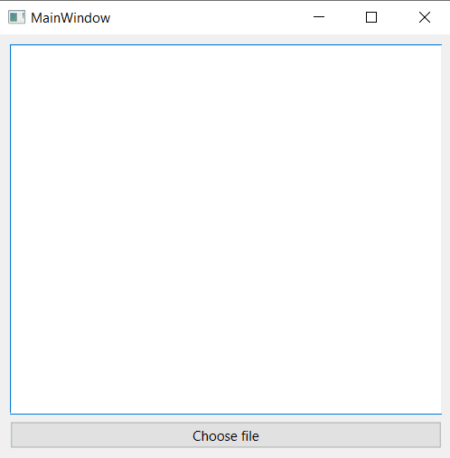
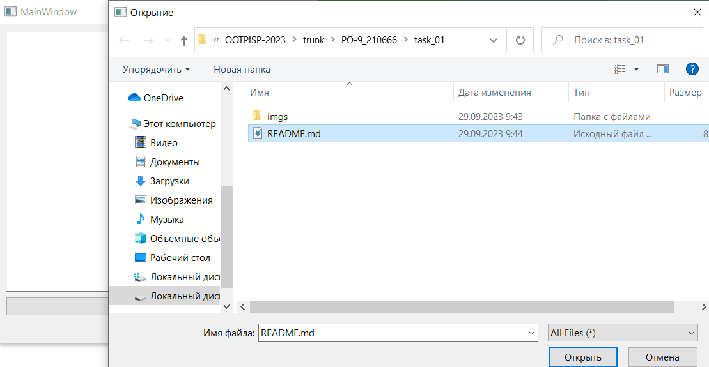
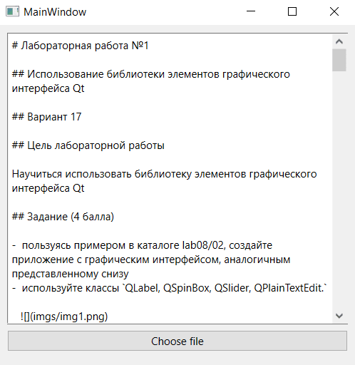

# Лабораторная работа №1

## Использование библиотеки элементов графического интерфейса Qt

## Вариант 17

## Цель лабораторной работы

Научиться использовать библиотеку элементов графического интерфейса Qt

## Задание (4 балла)

-  пользуясь примером в каталоге lab08/02, создайте приложение с графическим интерфейсом, аналогичным представленному снизу
-  используйте классы `QLabel, QSpinBox, QSlider, QPlainTextEdit.`

   

## Знакомство с элементами интерфейса: добавим функциональность (3 балла)

-  Добавим функциональность созданному на предыдущем этапе приложению:

   -  спин-боксы и слайдеры будут перемещаться синхронизировано в диапазоне значений от 0 до 255.
   -  Цвет фона QPlainTextEdit будет меняться соответственно

-  Выполнение:

   -  Выставляем диапазон допустимых значений для QSpinBox и QSlider при помощи методов setMinimum() и setMaximum()
   -  запрещаем ввод в текстовое поле: setEnabled(false)
   -  Реализуем метод setColor() и слоты setRed(int), setGreen(int), setBlue(int)
   -  к слотам подключаем сигналы QSlider::sliderMoved() и QSpinBox::valueChanged()
   -  в реализации слотов синхронизируем значения слайдера и спин-бокса и вызываем setColor()

-  Для изменения цвета фона текстового поля воспользуемся таблицами стилей для описания стиля элементов.
   -  таблицы стилей используют синтаксис CSS
   -  будем задавать цвет в виде строки типа #rrggbb
   -  таким образом, надо задать QPlainTextEdit следующий стиль:
   -  QPlainTextEdit { background: #rrggbb; }
   -  задаём стиль при помощи метода setStyleSheet() (таблица стиля передаётся в виде строки).

## Создаём простейший обозреватель текстовых файлов (3 балла)

-  Создайте новый виджет и поместите на него элемент QTextEdit.
-  Добавьте кнопку QPushButton и подключите её сигнал clicked() к слоту openFile()
-  Реализуйте в слоте выбор имени файла пользователем: QFileDialog::getOpenFileName()
-  Откройте QFile в соответствии с выбранным названием
-  Прочитайте его содержимое и поместите в виде текста в элемент QTextEdit

## Код программы

### Приложение выбора цвета

Файлы проекта:

-  [mainwindow.h](./src/mainwindow.h)
-  [mainwindow.cpp](./src/mainwindow.cpp)

Демонстрация работы приложения

### Обозреватель текстовых файлов

Файлы проекта:

-  [openfile.h](./src/openfile.h)
-  [openfile.cpp](./src/openfile.cpp)

Демонстрация работы приложения

## Вывод

Я научился использовать библиотеку элементов графического интерфейса Qt и создал 2 приложения, используя её
