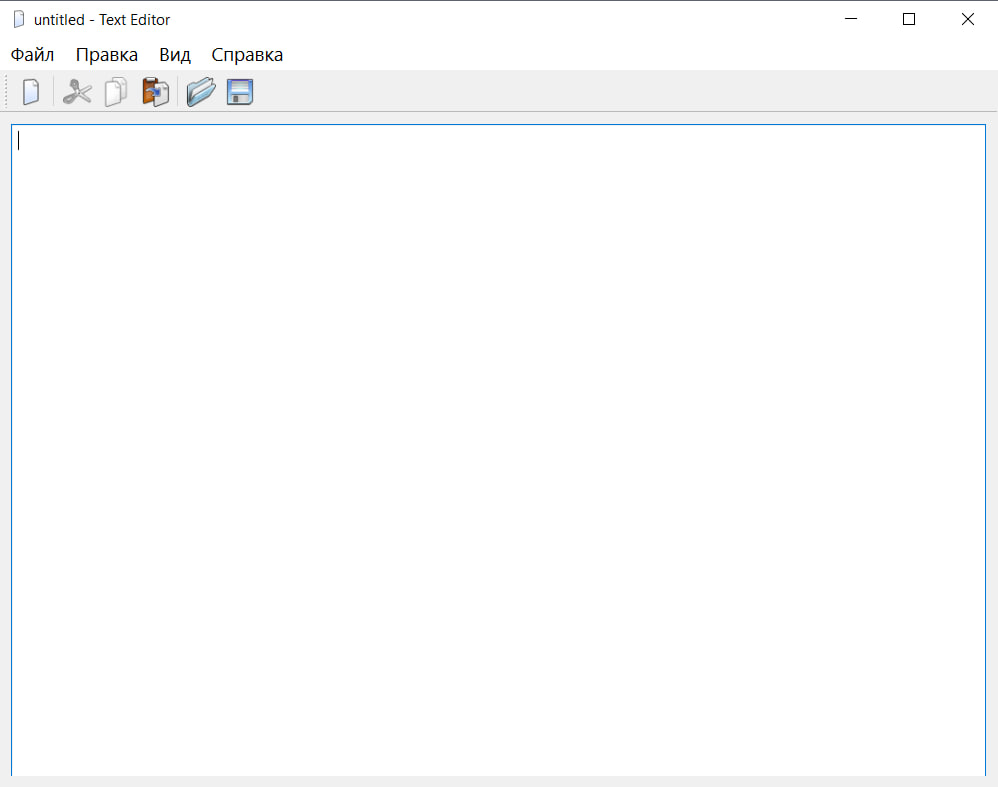
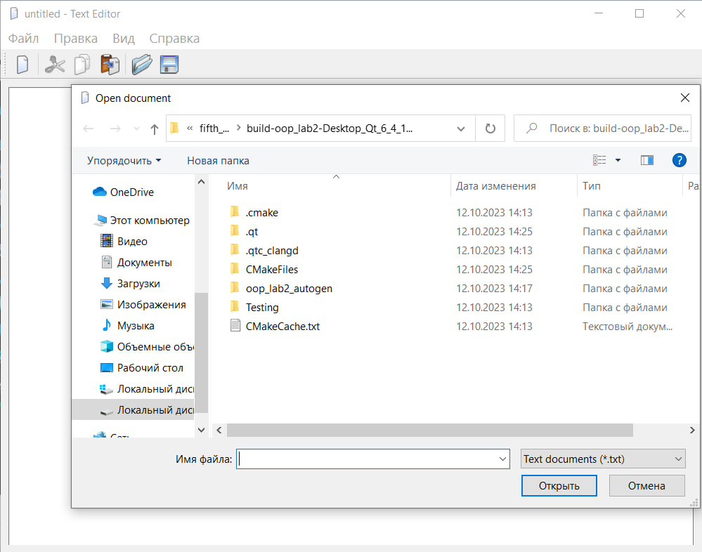
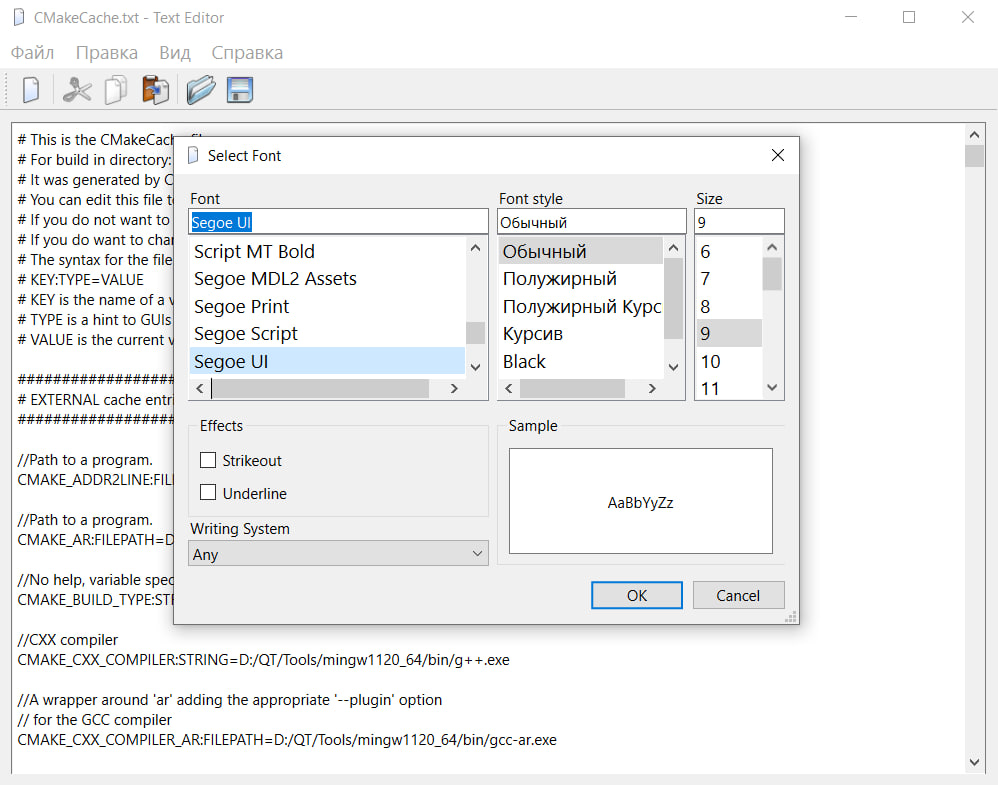
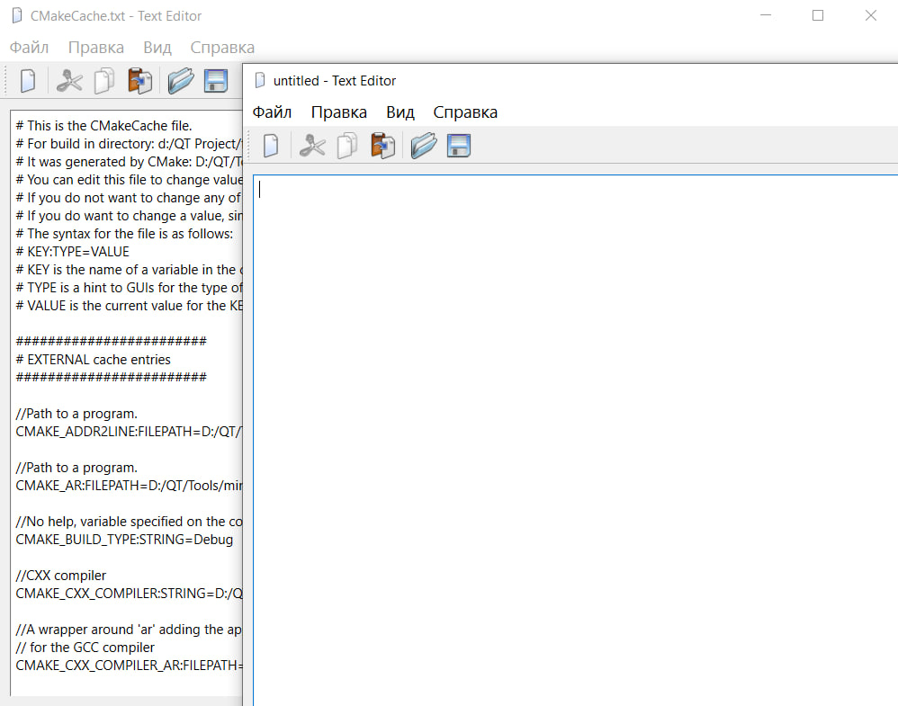
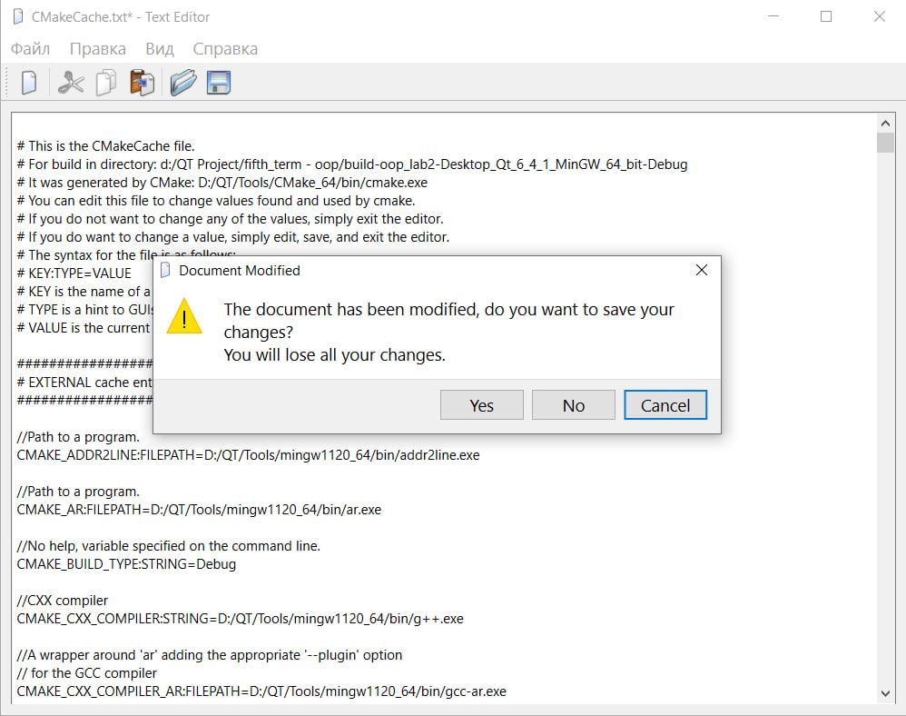
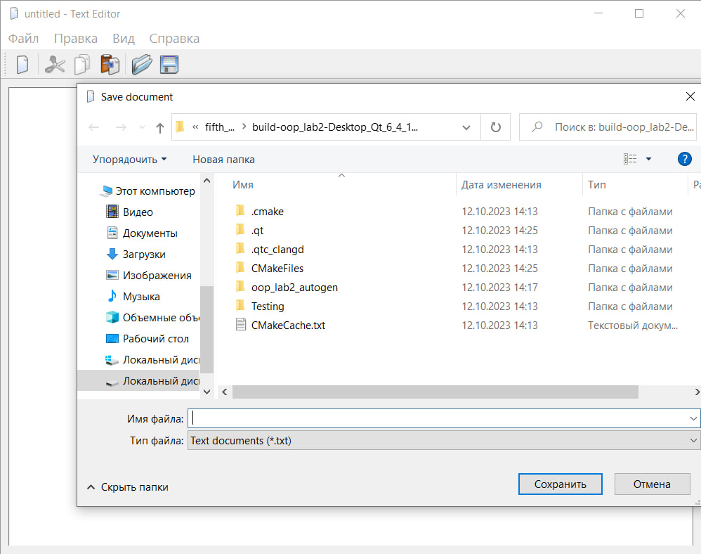

# Лабораторная работа №2

## Основы Qt

## Вариант 17

## Цель лабораторной работы

Эта лабораторная работа проведёт вас через все этапы построения законченного
приложения на Qt. Целью является понимание структуры приложения на Qt и
получение опыта использования стандартной документации Qt.

## Ход работы

Файлы проекта:

- [main.cpp](./src/main.cpp)
- [texteditor.h](./src/texteditor.h)
- [texteditor.cpp](./src/texteditor.cpp)
- [texteditor.qrc](./src/texteditor.qrc)

## Демонстрация работы приложения

При запуске приложения открывается окно:

Из приложения можно открывать выбранные файлы:

Меню выбора шрифта:

Можно запускать несколько приложений одновременно:

При закрытии измёненного файла открывается окно:

Окно сохранения файла:

## Вывод

Я создал приложение Qt, реализующее базовый функционал текстового редактора.

