# Лабораторная работа №3

## Контейнеры в Qt5

## Вариант 17

## Цель лабораторной работы

Научиться использовать контейнеры в Qt

## Задания

### Задание 1, Вариант 7

Формулировка

- Из трех данных чисел выбрать наименьшее и наибольшее (числа вводятся
  в lineedit), и заменить третье число иx разностью (число должно быть
  изменено в текущем lineedit).

Демонстрация работы приложения

Окно приложения:

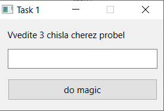

Введём три числа:

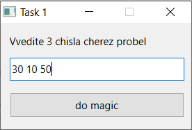

И при нажатии на кнопку получим:

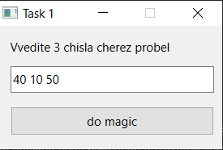

Файлы приложения

- [task1.h](./src/task1.h)
- [task1.cpp](./src/task1.cpp)
- [task1.ui](./src/task1.ui)

### Задание 2, Вариант 2

Формулировка

1. Дан массив размера N. Вывести вначале его элементы с четными индексами,
   а затем − с нечетными

2. Дана матрица размера m x n. Найти суммы элементов всех ее четных и нечетных
   столбцов (нахождение суммы четных/нечетных столбцов определяется пользователем
   в виджете comboBox).

Демонстрация работы приложения

Окно приложения:

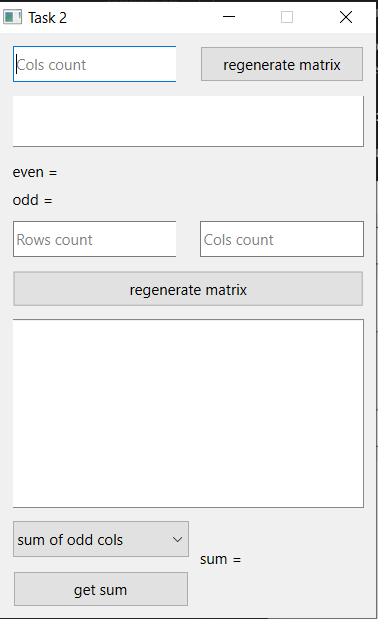

Введём число колонок для создания массива из первой части задания
(первый индекс = 0):

Введём число строк и колонок для создания матрицы второй части задания,
выберем сумму каких столбов будем находить и нажмём на кнопку для её получения:

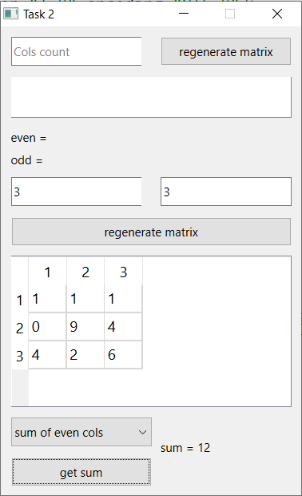

Файлы приложения

- [task2.h](./src/task2.h)
- [task2.cpp](./src/task2.cpp)
- [task2.ui](./src/task2.ui)

### Задание 3, Вариант 2

Формулировка

1. Заполнить список случайными элементами. Реализовать добавление элемента в
   конец списка и удаления с начала (использовать RadioButton для выбора действия).

2. Создать два связных списка. Реализовать замену одного связного списка на другой.

Демонстрация работы приложения

Окно приложения:

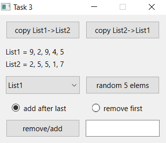

Верхние кнопки позволяют заменять один список другим:

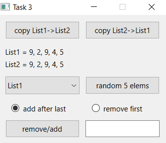

Чтобы добавить элемент в конец списка, нужно выбрать нужную кнопку,
записать добавляемое значение и нажать на кнопку:

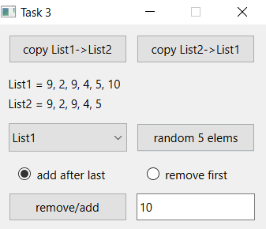

Также можно удалить первый элемент списка:

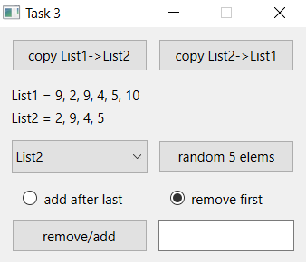

Файлы приложения

- [task3.h](./src/task3.h)
- [task3.cpp](./src/task3.cpp)
- [task3.ui](./src/task3.ui)

### Задание 4, Вариант 2

Формулировка

1. Сформировать стек из 10 случайных целых чисел. Заменить в стеке все
   положительные значения на 1, а отрицательные - на -1.

2. Сформировать очередь из 10 чисел. Увеличить все значения в очереди на
   ее максимальный элемент. Результат поместить в очередь.

Демонстрация работы приложения

Окно приложения:

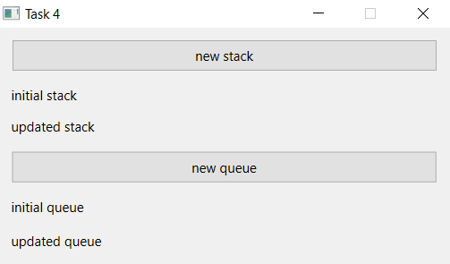

Сгенерируем стек и очередь:

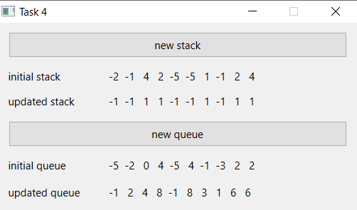

Файлы приложения

- [task4.h](./src/task4.h)
- [task4.cpp](./src/task4.cpp)
- [task4.ui](./src/task4.ui)

### Задание 5, Вариант 2

Формулировка

- Задан некоторый набор товаров. Определить для каждого товара, какие из
  них имеются в каждом из n магазинов, какие товары есть хотя бы в одном
  магазине, каких товаров нет ни в одном магазине.

Демонстрация работы приложения

Окно приложения:

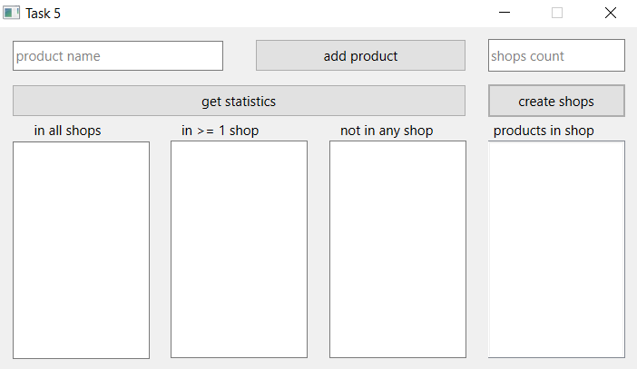

Введём необходимое количество магазинов и нажмён на кноку, чтобы создать их:

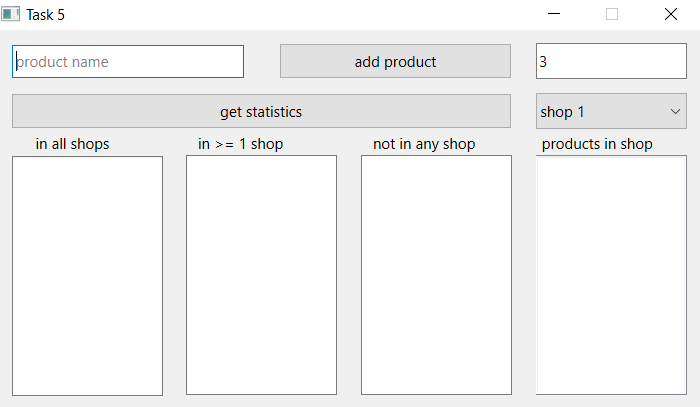

Теперь введём название продукта и добавим его, например pr1, pr2, pr3, pr4:

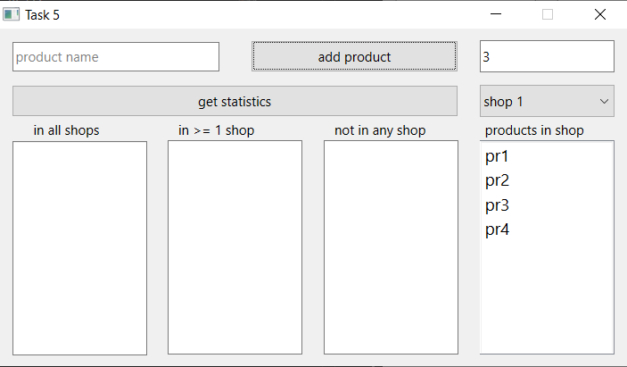

Теперь установим какие продукты находятся в каких магазинах, например:

- Shop 1

  - pr1
  - pr2

- Shop 2

  - pr1
  - pr3

- Shop 3

  - pr1

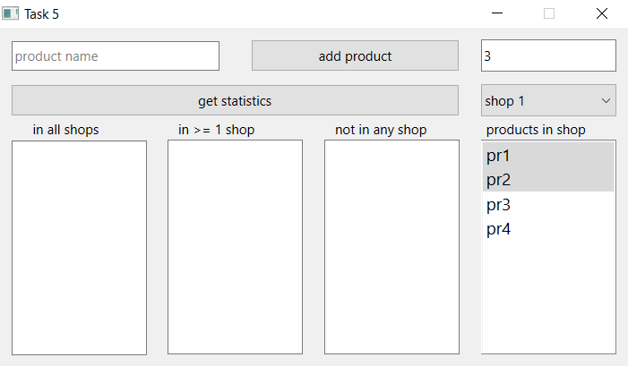

Нажмём на кнопку для получения статистики:

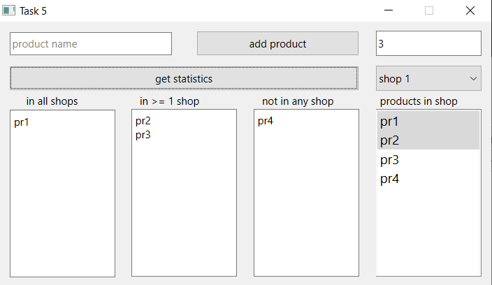

Файлы приложения

- [task5.h](./src/task5.h)
- [task5.cpp](./src/task5.cpp)
- [task5.ui](./src/task5.ui)

### Задание 6, Вариант 2

Формулировка

- Дан файл f, компоненты которого являются целыми числами. Запишите в файл
  g наибольшее значение первых пяти компонентов файла f, затем - следующих
  пяти компонентов и т.д. Если в последней группе окажется менее пяти
  компонентов, то последний компонент файла g должен быть равен наибольшему
  из компонентов файла f, образующих последнюю (неполную) группу.

Демонстрация работы приложения

Окно приложения:

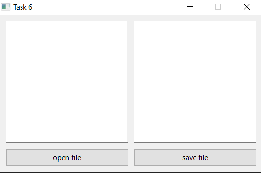

Откроем следующий файл:

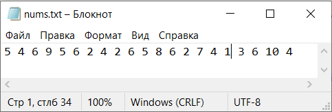

Приложение автоматически разобьёт числа на группы по 5 и обозначит максимальное:

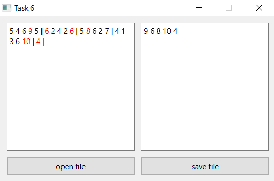

Можно записать в файл необходимые числа:

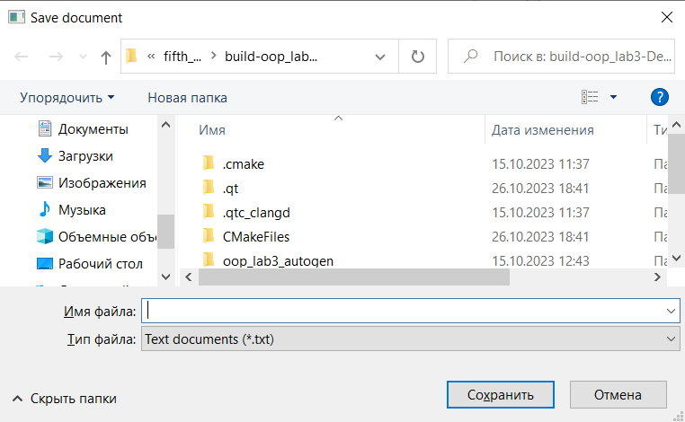

Файлы приложения

- [task6.h](./src/task6.h)
- [task6.cpp](./src/task6.cpp)
- [task6.ui](./src/task6.ui)

## Вывод

Я научился использовать контейнеры в Qt
