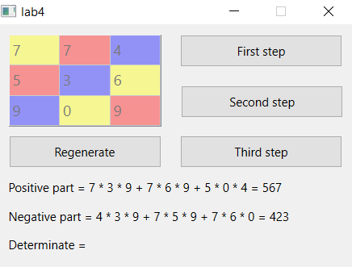
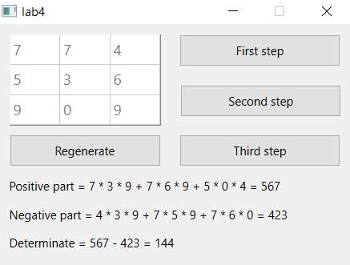
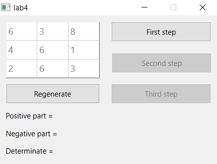

# Лабораторная работа №4

## Создание интерфейса простых приложений

## Вариант 17

## Цель лабораторной работы

Отработка умений и навыков описания событий в приложениях.

## Задание №5

Напишите программу, анимирующую операцию нахождения определителя матрицы 3х3.

Создайте интерфейс программы: в таблице 3х3 числа получить случайным образом по
сигналу от предусмотренной кнопки; кнопки «Шаг 1», «Шаг 2», «Шаг 3» и «Шаг 4»
должны выполнять соответствующие действия по определению определителя матрицы,
при этом на каждом шаге в таблице цветом должны быть подсвечены элементы, с
которыми производятся действия; результат должен быть выведен в поле надписи.

## Ход работы

Файлы проекта:

- [main.cpp](./src/main.cpp)
- [mainwindow.h](./src/mainwindow.h)
- [mainwindow.cpp](./src/mainwindow.cpp)
- [mainwindow.ui](./src/mainwindow.ui)

## Демонстрация работы приложения

При запуске приложения открывается окно:

Первый шаг нахождения определителя:

Второй шаг нахождения определителя:

Третий шаг нахождения определителя:

Есть возможность сгенерировать новую матрицу:

## Вывод

Я создал приложение Qt, анимирующее нахождение определителя матрицы.
