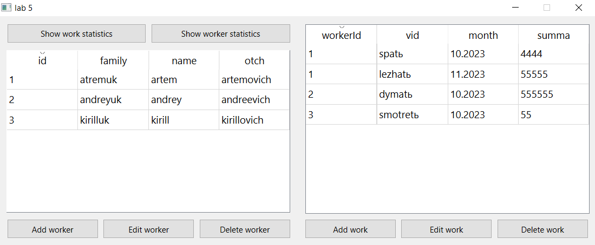
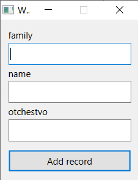
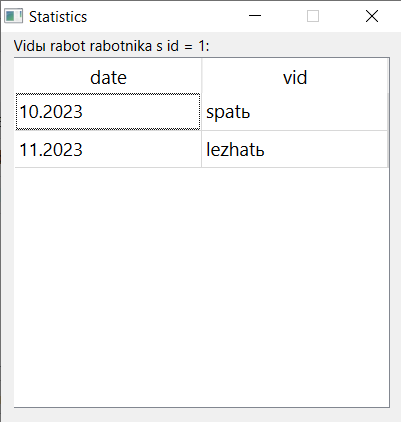
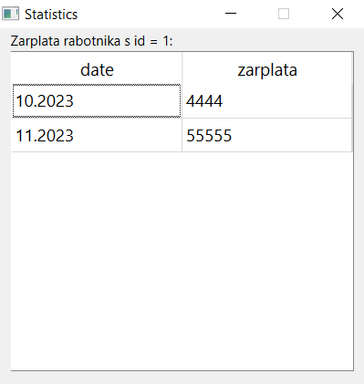

# Лабораторная работа №5

## Создание приложений баз данных

## Вариант 17

## Цель лабораторной работы

Отработка умений и навыков создания интерфейса баз данных.

## Задание №5

Напишите программу «Учет выплаты заработной платы».
В программе использовать две таблицы: fio (поля id, family, name, otch)
и vid (поля id, vid, month, summa). Создать запросы: вывод зар. платы за
месяц по каждому работнику; вывод вида работ работника за месяц.

## Ход работы

Основное окно:

- [mainwindow.h](./src/mainwindow.h)
- [mainwindow.cpp](./src/mainwindow.cpp)
- [mainwindow.ui](./src/mainwindow.ui)

Окно добавления работника:

- [addworker.h](./src/addworker.h)
- [addworker.cpp](./src/addworker.cpp)
- [addworker.ui](./src/addworker.ui)

Окно добавления работы:

- [addwork.h](./src/addwork.h)
- [addwork.cpp](./src/addwork.cpp)
- [addwork.ui](./src/addwork.ui)

Окно вывода запросов:

- [statistics.h](./src/statistics.h)
- [statistics.cpp](./src/statistics.cpp)
- [statistics.ui](./src/statistics.ui)

## Демонстрация работы приложения

При запуске приложения открывается окно:

Окно добавления работника:

Окно добавления работы:

Запрос вывода виды работ работника:

Запрос вывода зарплаты работника:

## Вывод

Я создал приложение Qt, анимирующее нахождение определителя матрицы.
