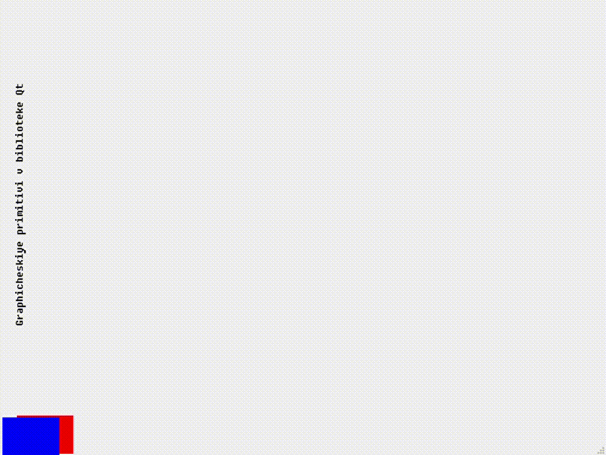

# Лабораторная работа №7

## Графические примитивы в библиотеке QT

## Вариант 17

## Цель лабораторной работы

Изучить графические примитивы библиотеки QT.

## Задание №3

- Вывести заданным шрифтом вертикально на экран наименование лабораторной работы.
- Нарисовать цветную фигуру и организовать движение её по заданной траектории.

|№ варианта|Шрифт|Фигура|Траектория движения|
| :-: | :-: | :-: | :-: |
|3|Матричный|Два частично перекрывающихся прямоугольника|Полукубическая парабола $$y = ax^{3 \over 2}$$|

## Ход работы

Основное окно:

- [mainwindow.h](./src/mainwindow.h)
- [mainwindow.cpp](./src/mainwindow.cpp)
- [mainwindow.ui](./src/mainwindow.ui)

## Демонстрация работы приложения

При запуске приложения открывается окно:

## Вывод

Я изучил графические примитивы библиотеки QT.
