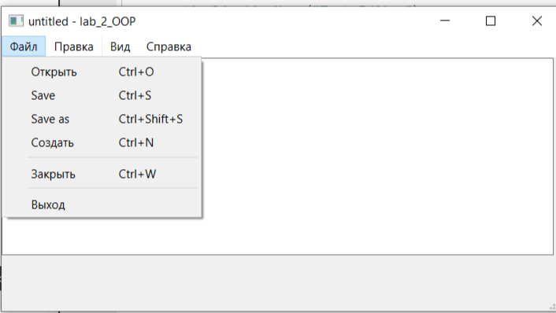
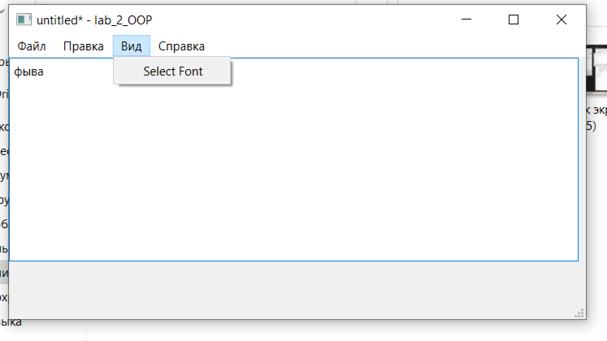
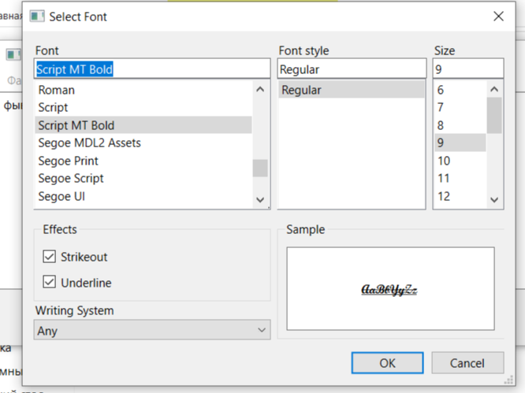
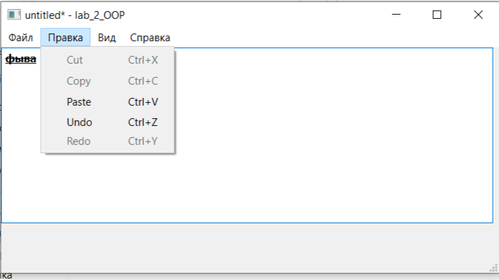
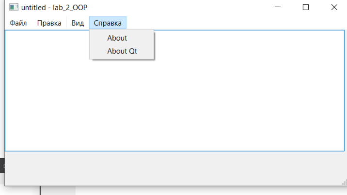
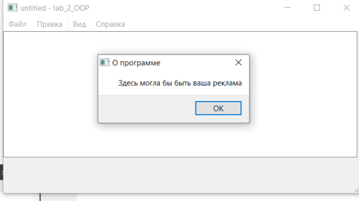

# Лабораторная работа №2 #

## Основы Qt ##

## Добавление элементов пользовательского интерфейса ##

Добавление виджета QTextEdit и основных пользовательских        действий *Создать*, *Закрыть*, *Save*, *Открыть*, *Save As* и *Выход* в главное окно.

## Параметры и настройка приложения ##

Практически все современные приложения имеют параметры, задаваемые пользователем. Сюда входит выбор единиц измерения, расположения панелей инструментов и более детальные параметры. На этом шаге мы разрешим пользователю выбрать шрифт для вывод текста документа

## Буфер обмена и история изменений ##

Добавление операции с буфером обмена *Вырезать, Копировать и Вставить*, а также действия *Отменить и Повторить*.

Поместите действия «О программе» и «О Qt» в меню *Справка*.

