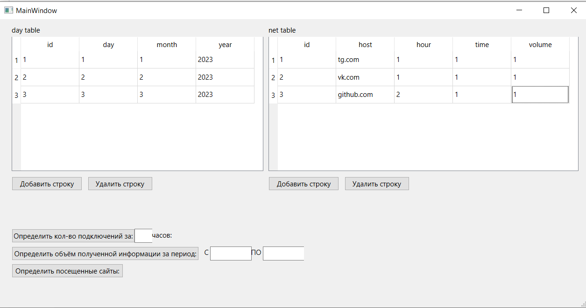
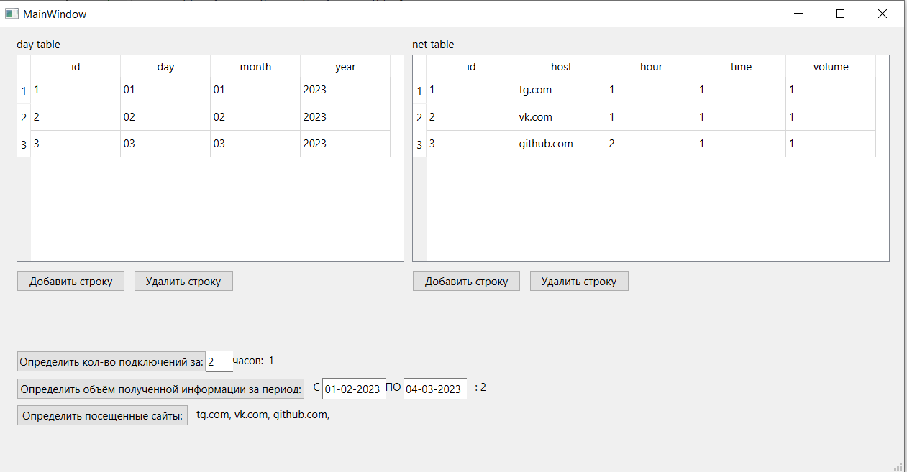

# Лабораторная работа №5 #

## Создание приложений баз данных

## Вариант №18(6)

`Оводок Вадим Вячеславович (ПО-9)`

### Цель работы ###

Отработка умений и навыков создания интерфейса баз данных.

### Задание ###

Средствами IDE  Qt designer создать интерфейс программы, осуществляющей подключение к базе данных SQLite. С помощью программы SQLiteManager создать необходимые таблицы в файле базы данных. Наполнение таблиц осуществлять из созданной программы.
Напишите программу «Учет работы в Internet». В программе использовать две таблицы: day (поля id, day, month, year) и net (поля id, host, hour, time, volume). Создать запросы: определение количества подключений за указанный час; объем полученной информации за указанный период; посещенные сайты.

## Вывод лабораторной работы ##

Отработал умения и навыки создания интерфейса баз данных.