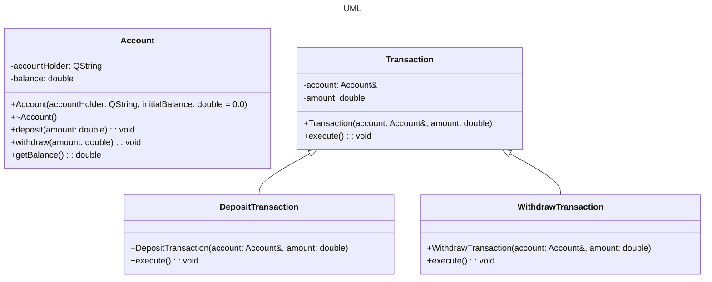

# Лабораторная работа № 6 #

`Оводок Вадим Вячеславович(ПО-9)`

## UML - диаграммы ##

## Вариант 8 ##

```mermaid

---
title: UML
---
classDiagram
    class Account {
        +Account(accountHolder: QString, initialBalance: double = 0.0)
        +~Account()
        +deposit(amount: double): void
        +withdraw(amount: double): void
        +getBalance(): double
        -accountHolder: QString
        -balance: double
    }

    class Transaction {
        +Transaction(account: Account&, amount: double)
        +execute(): void
        -account: Account&
        -amount: double
    }

    class DepositTransaction {
        +DepositTransaction(account: Account&, amount: double)
        +execute(): void
    }

    class WithdrawTransaction {
        +WithdrawTransaction(account: Account&, amount: double)
        +execute(): void
    }

    
    Transaction <|-- DepositTransaction 
    Transaction <|-- WithdrawTransaction

```
