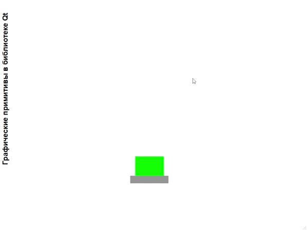

# Лабораторная работа №7 #

## Графические примитивы в библиотеке QT ##

`Оводок Вадим Вячеславович (ПО-9)`

## Вариант 4 ##

## Цель лабораторной работы ##

Изучить графические примитивы библиотеки QT.

## Задание ##

- Вывести заданным шрифтом вертикально на экран наименование лабораторной работы.
- Нарисовать цветную фигуру и организовать движение её по заданной траектории.

|№ варианта|Шрифт|Фигура|Траектория движения|
| :-: | :-: | :-: | :-: |
|4|Полужирный|Прямоугольник, поставленный на пьедестал|Закручивающаяся спираль|

## Результат работы программы ##

## Вывод ##

Изучил графические примитивы библиотеки QT.
