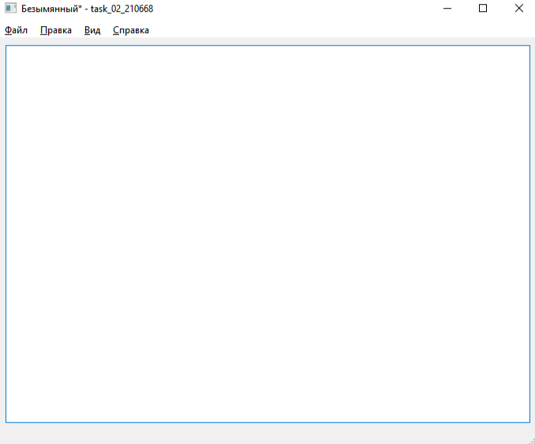
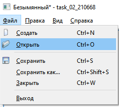
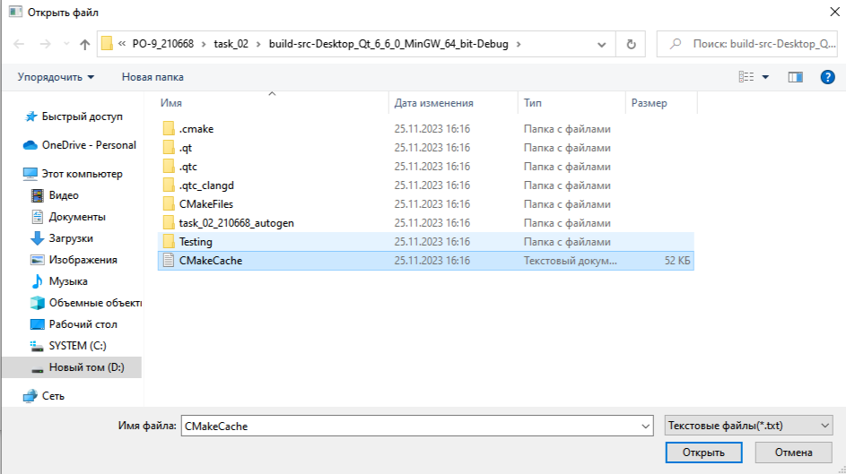
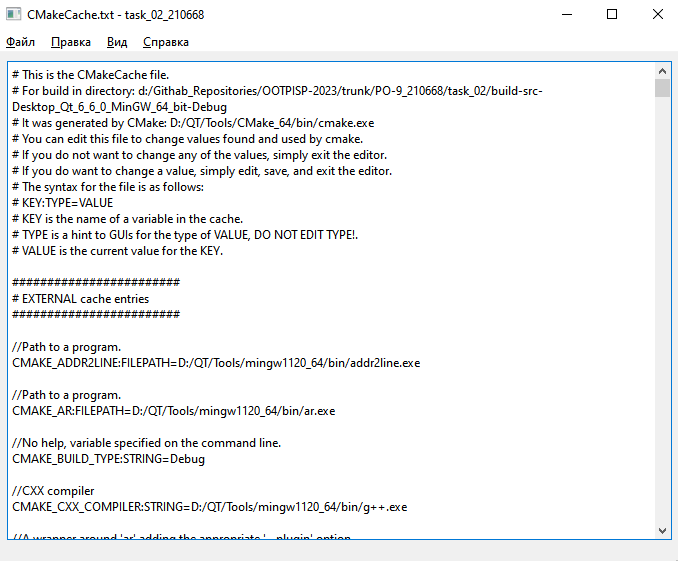
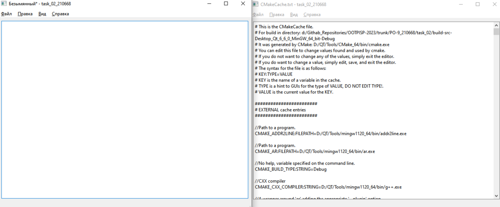
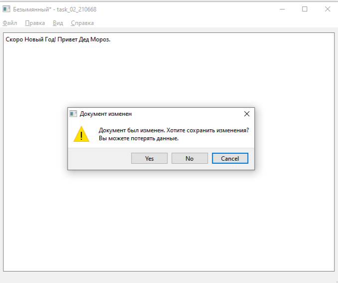
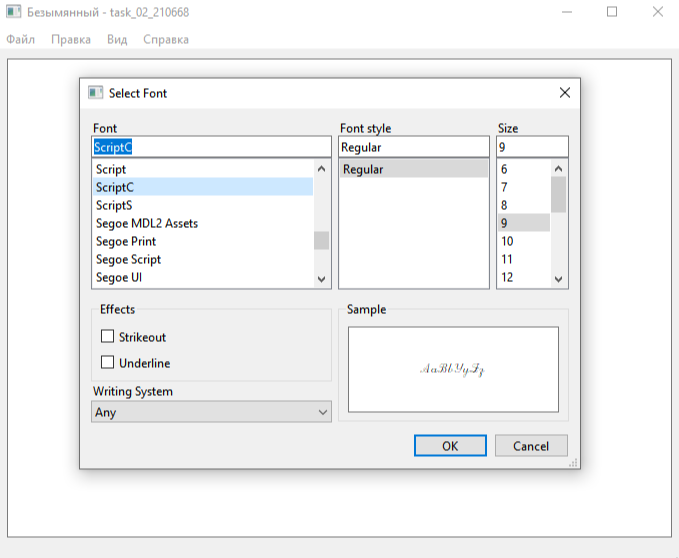

# Лабораторная работа №2 #

## Вариант 19 ##

Солышко Дмитрий Андреевич (ПО-9)

## Основы Qt ##

Задание: нужно реализовать простейший редактор txt-файлов с минимальным но удобным интерфейсом.

## Результат работы программы ##

При запуске программы нас встречает окно с пустым файлом, который мы можешь редактировать:

Открыть файл не составит проблем:

Находим необходимый нам файл:

Открытие файла успешно прошло:

Программа поддерживает несколько окон:

О изменениях предупреждает. При нажатии на yes предлагает сохранить файл:

Также можно менять шрифт

   

Вывод: я понял структуру приложения на Qt и получил опыт использования стандартной документации Qt.
