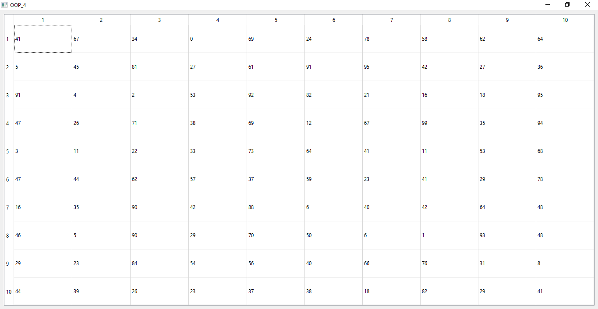
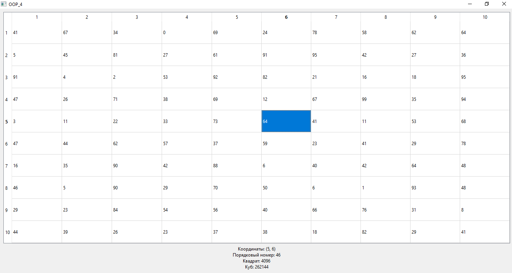

# Лабораторная работа №4

## Создание интерфейса простых приложений

## Вариант 19

## Цель лабораторной работы

Отработка умений и навыков описания событий в приложениях.

## Задание №7

Напишите программу, которая при клике ЛКМ в ячейке таблицы 10х10, в зависимости от положения указателя в поле надписи выводит: координаты элемента таблицы; порядковый номер элемента, квадрат и куб его значения. Создайте интерфейс программы: в таблице 10х10 числа получить случайным образом; создать компонент выбора и кнопки выполняемых действий; результат действий выводить в поле надписи.

## Ход работы

Основные пункты:

- Подключаем необходимые библиотеки

- Создаём таблицу

- Подключаем таблицу

- Заполняем таблицу рандомными числами от 0 до 99

- Создаём фунцию handleCellClick(int row, int column), по строке и столбцу находим значение, а далее высчитываем индекс, квадрат и куб:

```c++
QTableWidgetItem *item = table->item(row, column);
    int value = item->text().toInt();
    int index = row * 10 + column;
    int square = value * value;
    int cube = value * value * value;
```

## Демонстрация работы приложения

Исходная заполненная таблица:



Нажатие ЛКМ на поле и вывод информации о значении:



## Вывод

Я создал приложение Qt, анимирующее нахождение определителя матрицы.
