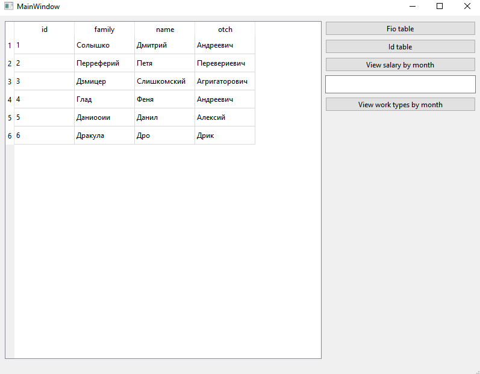
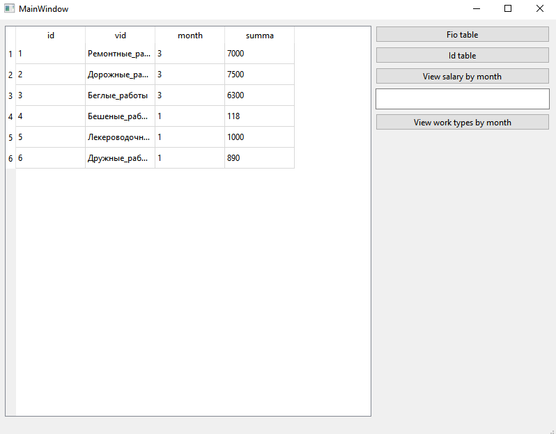
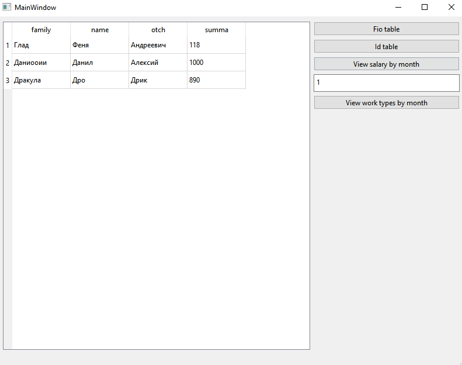
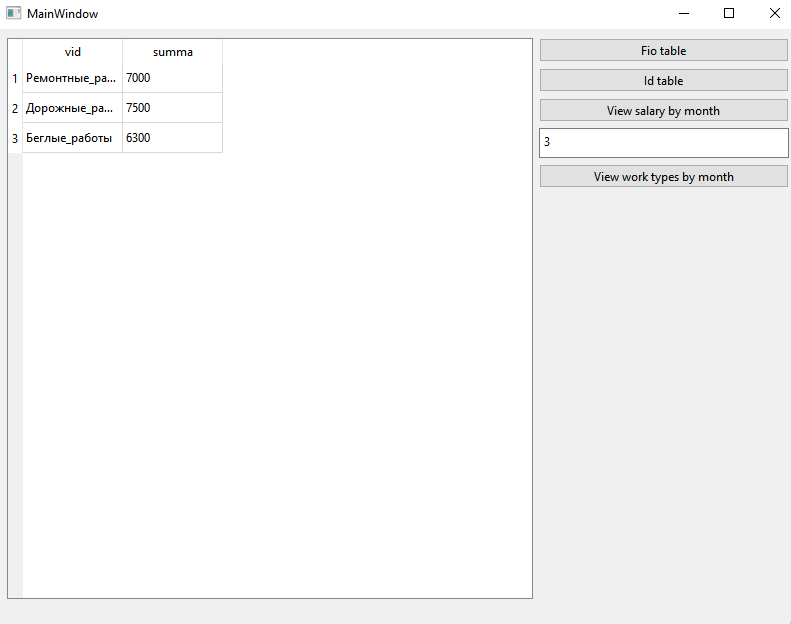

# Лабораторная работа №5 #

## Создание приложений баз данных ##

## Солышко Дмитрий Андреевич (ПО-9) ##

## Вариант 19 ##

## Цель лабораторной работы ##

Отработка умений и навыков создания интерфейса баз данных.

## Задание лабораторной работы ##

Напишите программу «Учет выплаты заработной платы». В программе использовать две таблицы: fio (поля id, family, name, otch) и vid (поля id, vid, month, summa). Создать запросы: вывод зар. платы за месяц по каждому работнику; вывод вида работ работника за месяц.

## Результат работы программы ##

Вывод таблицы Fio:

Вывод таблицы Vid:

Поиск заработной платы за месяц по каждому работнику:

Определение вида работ работника за месяц:

## Вывод ##

Отработали умения и навыки создания интерфейса баз данных.
