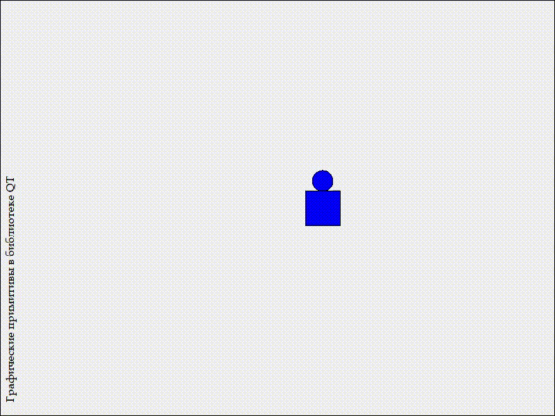

# Лабораторная работа №7

## Графические примитивы в библиотеке QT

## Вариант 19

## Цель лабораторной работы

Изучить графические примитивы библиотеки QT.

## Задание №5 (19 % 14 = 5)

- Вывести заданным шрифтом вертикально на экран наименование лабораторной работы.

- Нарисовать цветную фигуру и организовать движение её по заданной траектории.

|№ варианта|Шрифт|Фигура|Траектория движения|
| :-: | :-: | :-: | :-: |
|5|Книжная гарнитура|Окружность на поставленном прямоугольнике|Синусоида $$y = asin(x+b)$$|

## Ход работы

- Вывести шрифтом "Книжная гарнитура" вертикально на экран надпись "Графические примитивы в библиотеке QT".

- Нарисовал фигуру (окружность на прямоугольнике) синим цветом

- Реализовал движение по траектории синусоиды $$y = asin(x+b)$$

## Демонстрация работы приложения

Результатом работы программы является:

## Вывод

Я изучил графические примитивы библиотеки QT.
