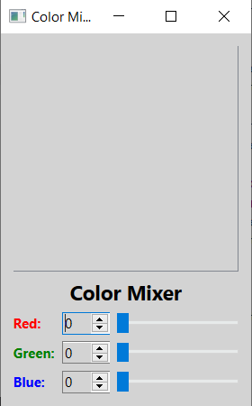
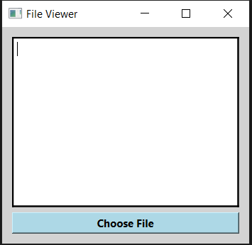
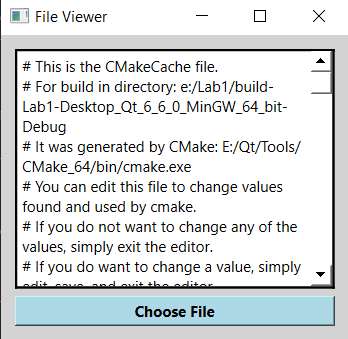

# Лабораторная работа №1

## Использование библиотеки элементов графического интерфейса Qt

## Вариант 20

## Ход работы

### Задание (4 балла)

- пользуясь примером в каталоге `lab08/02`, создайте приложение с графическим интерфейсом, аналогичным представленному сверху

- используйте классы `QLabel`, `QSpinBox`, `QSlider`, `QPlainTextEdit`.

### Знакомство с элементами интерфейса: добавим функциональность. (3 балла)

#### Добавим функциональность созданному на предыдущем этапе приложению

- спин-боксы и слайдеры будут перемещаться синхронизировано в диапазоне значений `от 0 до 255`.

- цвет фона `QPlainTextEdit` будет меняться соответственно

#### Выполнение

### Диалоги (3 балла)

#### Создаём простейший обозреватель текстовых файлов

- Создайте новый виджет и поместите на него элемент `QTextEdit`.

- Добавьте кнопку `QPushButton` и подключите её сигнал `clicked()` к слоту `openFile()`

- Реализуйте в слоте выбор имени файла пользователем: `QFileDialog::getOpenFileName()`

- Откройте `QFile` в соответствии с выбранным названием

- Прочитайте его содержимое и поместите в виде текста в элемент `QTextEdit`

