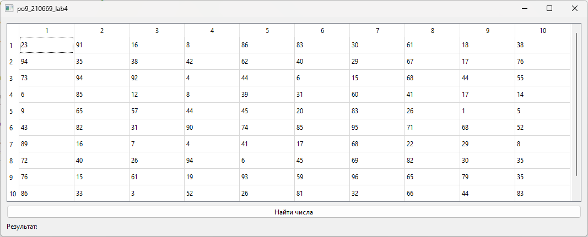
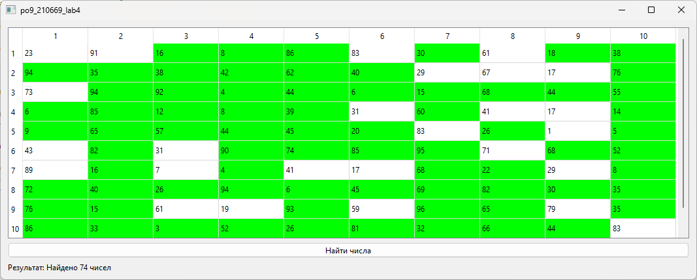

# Лабораторная работа №4

## Создание интерфейса простых приложений

## Вариант 20

## Цель лабораторной работы

Отработка умений и навыков описания событий в приложениях.

## Задание №8

Напишите программу, которая находит в массиве 10х10 числа делимые на 2, 3, 4, 5 и 6. Создайте интерфейс программы: в таблице 10х10 числа получить случайным образом; создать кнопки выполняемых действий; результат действий подсвечивать цветом; в поле надписи выводить количество найденных чисел.

## Демонстрация работы приложения

Исходная заполненная таблица:

Нажатие ЛКМ на кнопку и вывод информации о кол-ве значений:

