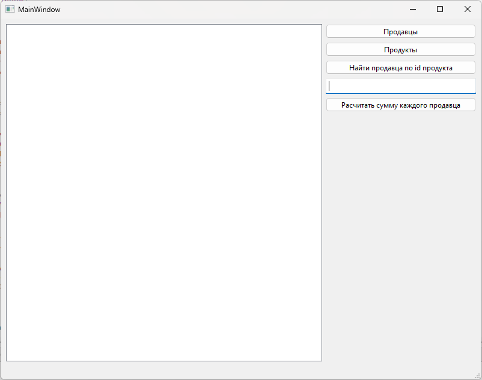
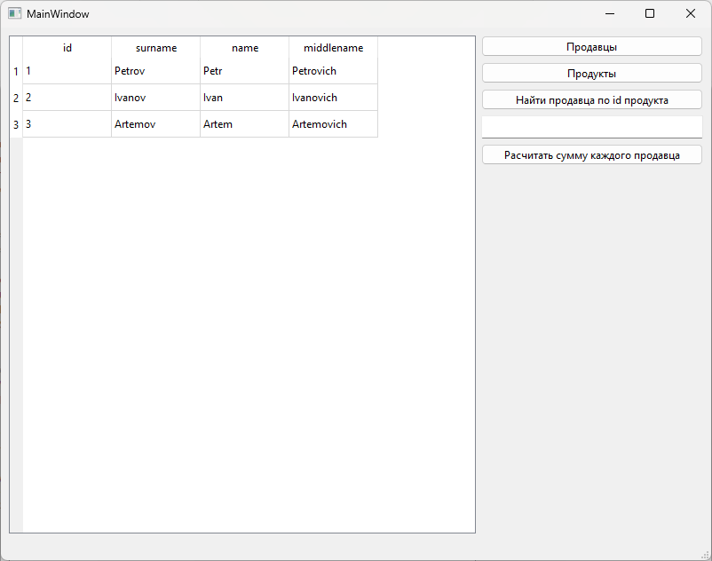
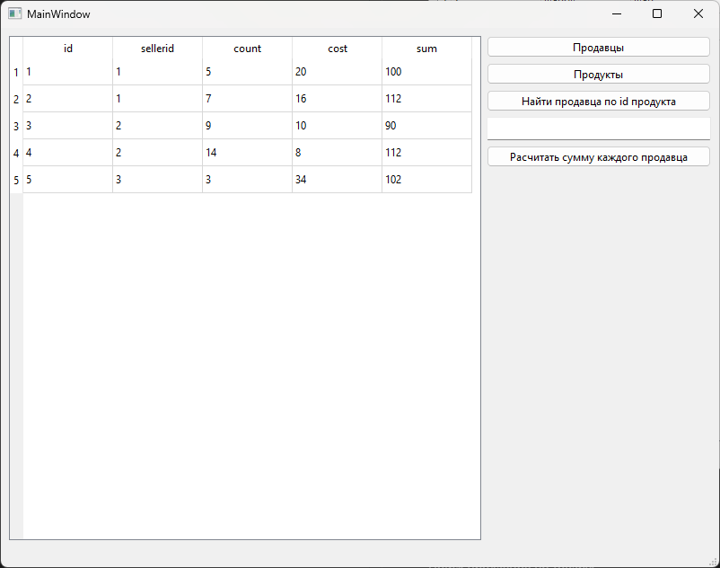
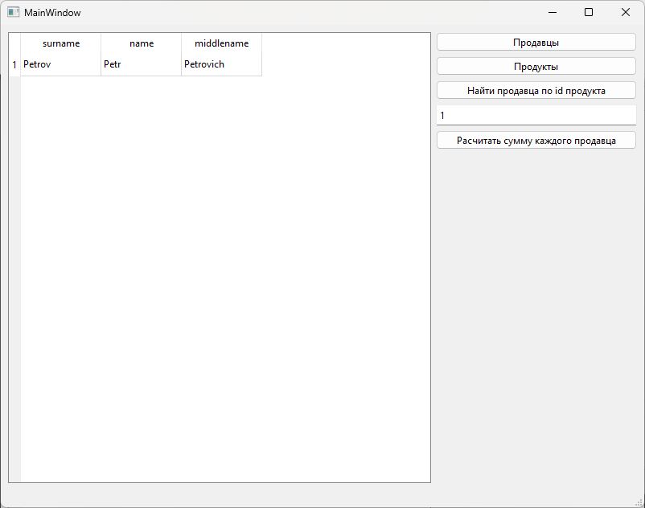
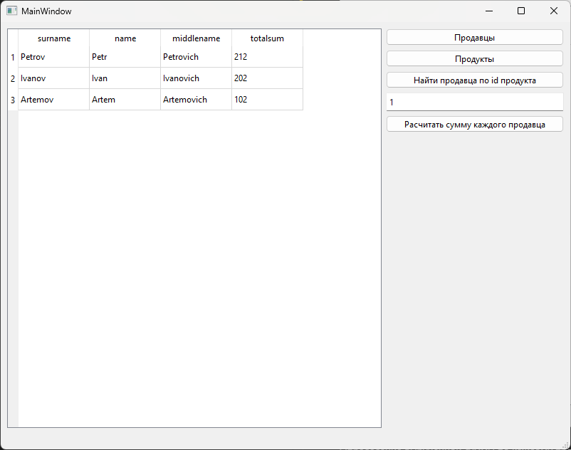

# Лабораторная работа №5 #

## Создание интерфейса простых приложений ##

## Вариант 3 ##

## Результат работы программы ##

Окно программы:

Вывод таблицы продавцов:

Вывод таблицы продуктов:

Поиск продавцов по товару:

Определение вырученной суммы по каждому продавцу:

