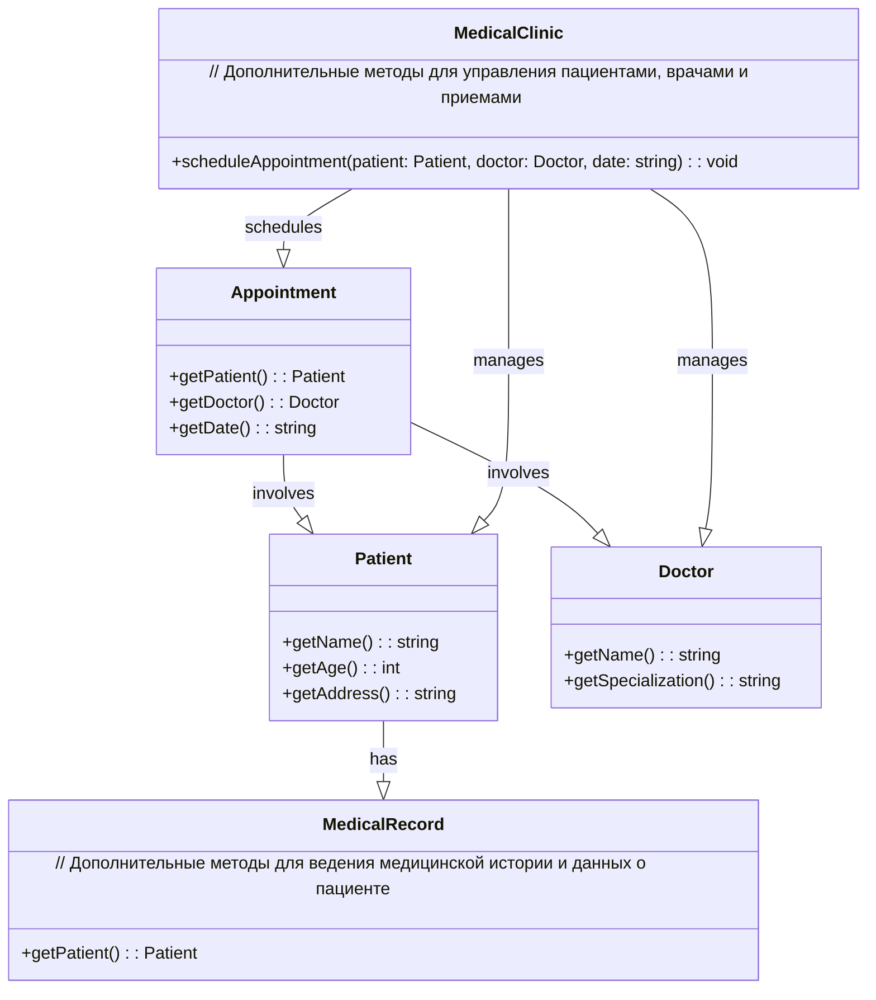

# Лабораторная работа №6

## Создание интерфейса простых приложений

## Вариант 20

## Цель лабораторной работы

Отработка умений и навыков описания событий в приложениях.

## Задание №10

Постройте UML диаграмму классов для системы управления медицинской клиникой.

## Демонстрация UML диаграммы

