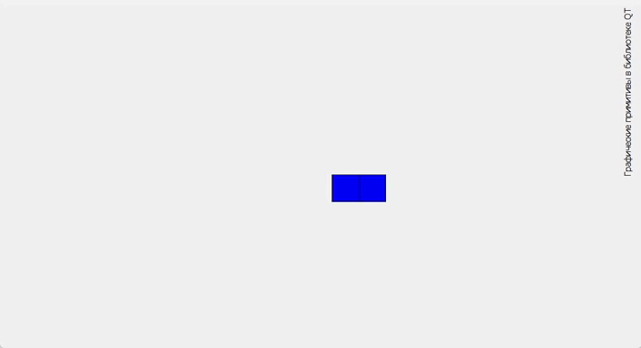

# Лабораторная работа №7

## Графические примитивы в библиотеке QT

## Вариант 20

## Цель лабораторной работы

Изучить графические примитивы библиотеки QT.

## Задание №6 (20 % 14 = 6)

|№ варианта|Шрифт|Фигура|Траектория движения|
| :-: | :-: | :-: | :-: |
|6|Готический|Два прямоугольника, имеющих один общий угол|Отрезок прямой, проведённой из левого верхнего в правый нижний угол экрана|

## Демонстрация работы приложения

Результатом работы программы является:

