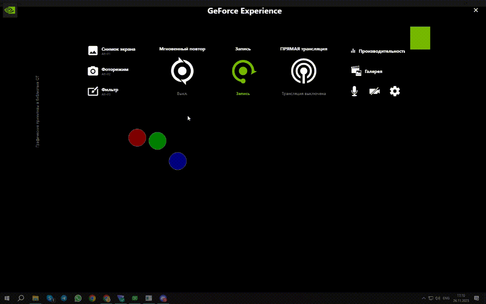

# Лабораторная работа №7

## Графические примитивы в библиотеке QT

## Вариант 22

## Цель лабораторной работы

Изучить графические примитивы библиотеки QT.

## Задание №8 (22 % 14 = 8)

|№ варианта|Шрифт|Фигура|Траектория движения|
| :-: | :-: | :-: | :-: |
|8|Светлый|Три окружности по горизонтали|Синусоида|

## Демонстрация работы приложения

Результатом работы программы является:

