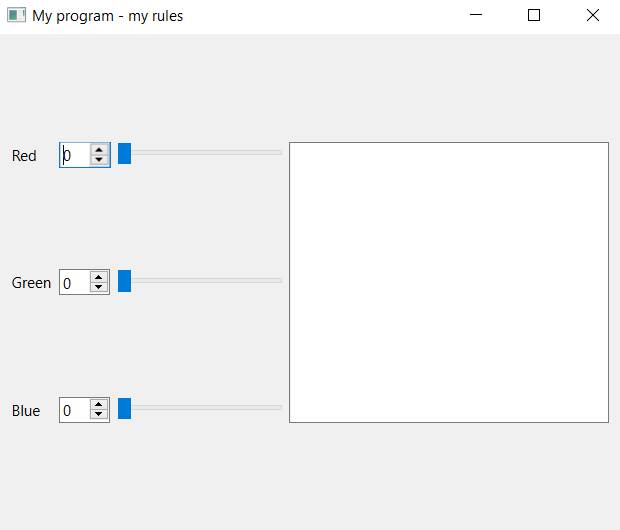
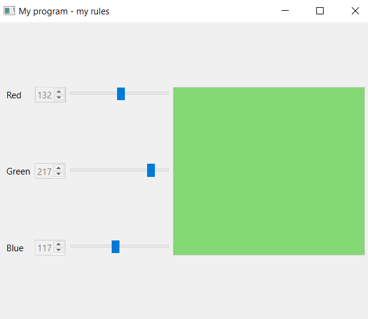
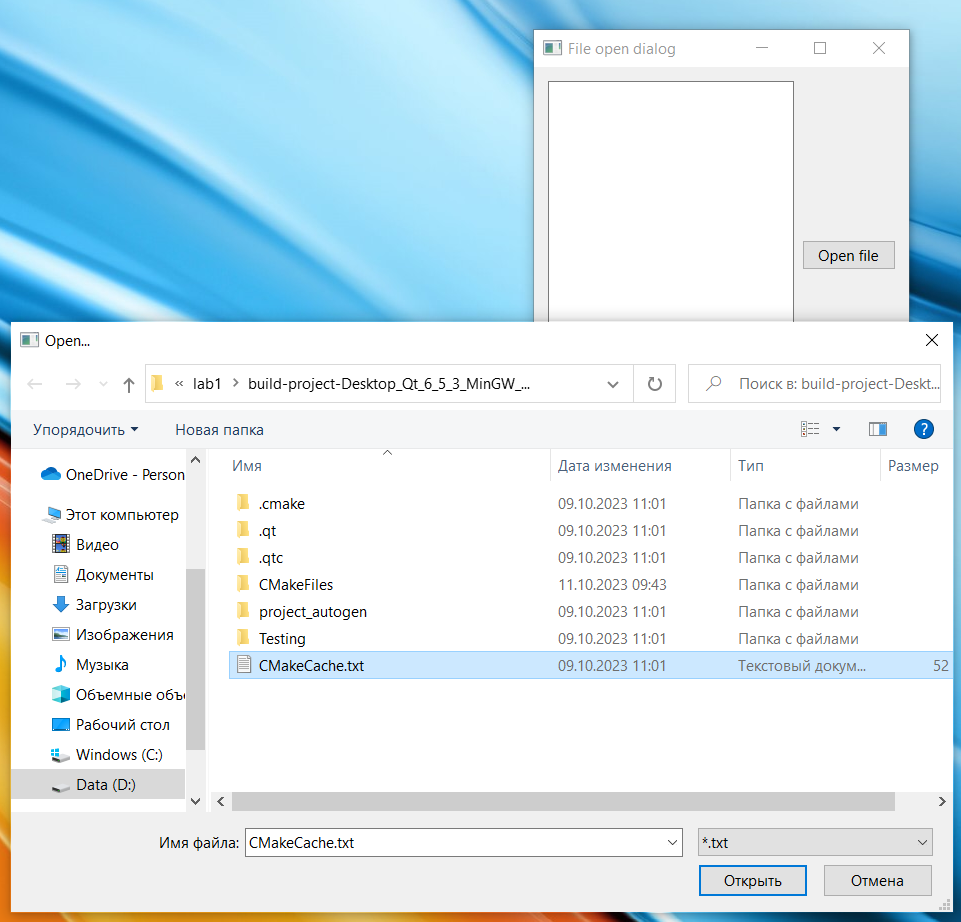
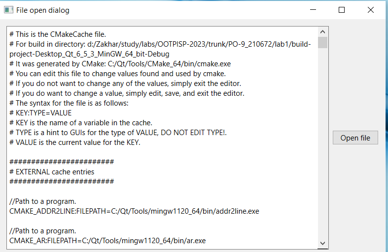

# Лабораторная работа №1

## Использование библиотеки элементов графического интерфейса Qt

## Вариант 23

## Ход работы

### Задание (4 балла)

- пользуясь примером в каталоге `lab08/02`, создайте приложение с графическим интерфейсом, аналогичным представленному сверху

- используйте классы `QLabel`, `QSpinBox`, `QSlider`, `QPlainTextEdit`.

### Знакомство с элементами интерфейса: добавим функциональность. (3 балла)

#### Добавим функциональность созданному на предыдущем этапе приложению

- спин-боксы и слайдеры будут перемещаться синхронизировано в диапазоне значений `от 0 до 255`.

- цвет фона `QPlainTextEdit` будет меняться соответственно

#### Выполнение

- Выставляем диапазон допустимых значений для `QSpinBox` и `QSlider` при помощи методов `setMinimum()` и `setMaximum()`

- запрещаем ввод в текстовое поле: `setEnabled(false)`

- Реализуем метод `setColor()` и слоты `setRed(int)`, `setGreen(int)`, `setBlue(int)`

- к слотам подключаем сигналы `QSlider::sliderMoved()` и `QSpinBox::valueChanged()`

- в реализации слотов синхронизируем значения слайдера и спин-бокса и вызываем `setColor()`

#### Для изменения цвета фона текстового поля воспользуемся таблицами стилей для описания стиля элементов

- таблицы стилей используют синтаксис `CSS`

- будем задавать цвет в виде строки типа `#rrggbb`

- таким образом, надо задать `QPlainTextEdit` следующий стиль:

  - `QPlainTextEdit { background: #rrggbb; }`

- задаём стиль при помощи метода `setStyleSheet()` (таблица стиля передаётся в виде строки).

### Диалоги (3 балла)

Библиотека графических элементов Qt предлагает набор из нескольких полнофункциональных диалоговых окон, позволяющих выполнять некоторые стандартные операции. Среди них такие, как выбор файла в файловой системе, выбор шрифта, выбор цвета, диалог печати и некоторые другие. Мы рассмотрим в настоящей работе пример использования диалога выбора файла - `QFileDialog`.

#### Создаём простейший обозреватель текстовых файлов

- Создайте новый виджет и поместите на него элемент `QTextEdit`.

- Добавьте кнопку `QPushButton` и подключите её сигнал `clicked()` к слоту `openFile()`

- Реализуйте в слоте выбор имени файла пользователем: `QFileDialog::getOpenFileName()`

- Откройте `QFile` в соответствии с выбранным названием

- Прочитайте его содержимое и поместите в виде текста в элемент `QTextEdit`

