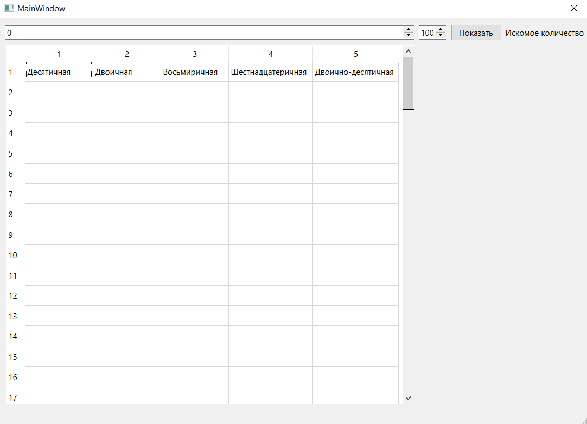
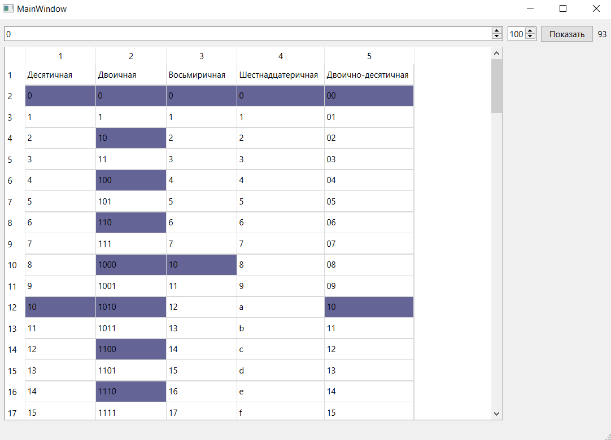
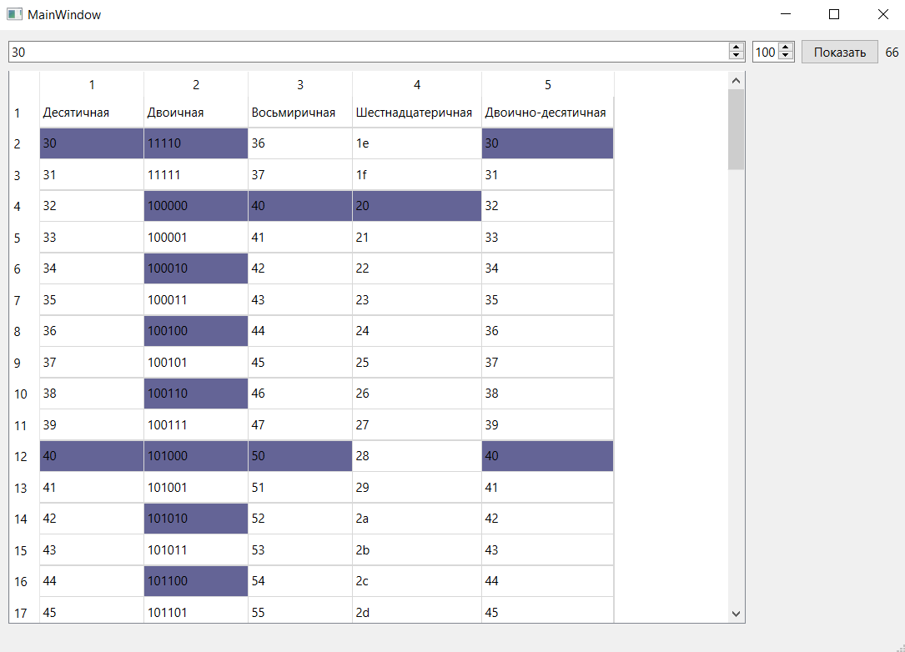

# Лабораторная работа №4

## Создание интерфейса простых приложений

## Вариант 23 (11)

## Цель работы

Отработка умений и навыков описания событий в приложениях

## Ход работы

Напишите программу, которая выводит в таблицу с 5 полями числа в десятичной, двоичной, восьмеричной, шестнадцатеричной и двоично-десятичной системах счисления соответственно в указанном диапазоне. Создайте интерфейс программы: два поля ввода должны принимать целые числа от 0 до 100; по клику на кнопке «Показать», в таблице 5хN вывести числа в указанных системах счисления в указанном диапазоне; подсветить цветом значения содержащие ноль в младшем разряде; в поле надписи выводить количество таких значений.

