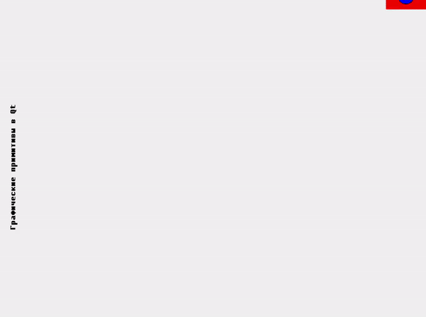

# Лабораторная работа №7

## Графические примитивы в библиотеке QT

## Вариант 23 (9)

Шрифт - полужирный

Фигура - поставленный прямоугольник и окружность у его подножия

Траектория - кубическая парабола

## Демонстрация работы

