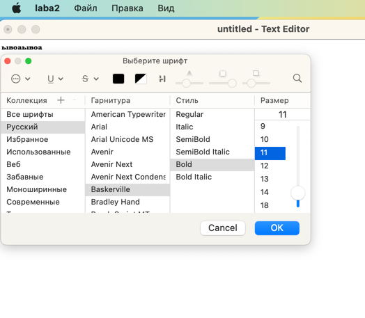

# Отчет по лабораторной работе №2

## Основы Qt

## Вариант №24

`Шубия Дарья Константиновна (ПО-9)`

## Ход работы

1. При открытии программы мы видим первый экран

2. Мы можем производить разные операци, такие как "сохраненить", "сохранить как", "открыть", "выход", "закрыть", "создать".
Также добавлены горячие клавиши.

3. Возможно произвети и такие операции

4. Изменения в текстовом файле отображаются точкой на кнопке закрытия

5. При закрытии документа всплывает предупреждающее окно

6. Можно изменить шрифт

7. Поддержка нескольких окон

