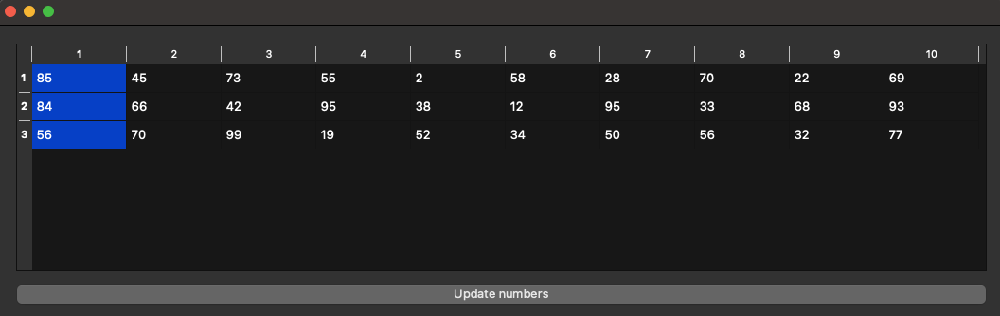
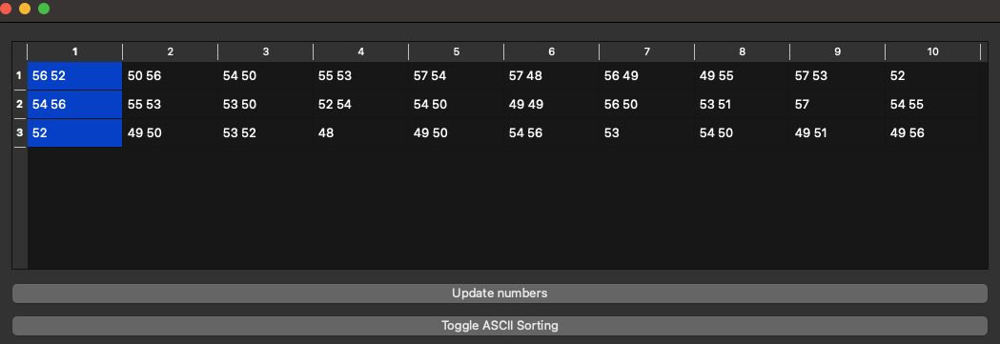

# Лабораторная работа №4 #

## Создание интерфейса простых приложений ##

## Цель лабораторной работы ##

Отработка умений и навыков описания событий в приложениях.

## Вариант №12 ##

`Шубич Дарья Константиновна (ПО-9)`

## Ход работы ##
1. Создала таблицу 3х10.
   

2. Добавила кнопку для заполнения таблицы случайными числами.
   

3. Реализовала сортировку по возрастанию для каждого отдельного столбца. Сортировка происходит по нажатию на заголовок столбца

4. Реализовала сортировку по убыванию для каждого отдельного столбца.

5. Также реализовала сортировку по ASCII коду. Для наглядности добавила кнопку перевода значений в формат ASCII кода.

## Вывод лабораторной работы ##

Отработала умений и навыков описания событий в приложениях.
