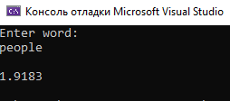
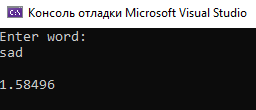

# Лабораторная работа №6 #

## DLL: динамически загружаемые библиотеки ##

`Шубич Дарья Константиновна (ПО-9)`

## Вариант 3 ##

## Цель работы ##

Научиться создавать простейшие DLL.

### Задание ###

Создать библиотеку, считающую энтропию введённого слова.
```  c++

#include "pch.h"
#include "Header.h"
#include <cmath>
double sortAscendingg(const char* word) {
    if (!word)
        return 0.0;

    int charCount[256] = { 0 };
    int length = 0;

    // Подсчет количества каждого символа в слове
    while (*word) {
        charCount[static_cast<unsigned char>(*word)]++;
        length++;
        word++;
    }

    double entropy = 0.0;

    // Вычисление энтропии
    for (int i = 0; i < 256; i++) {
        if (charCount[i] > 0) {
            double probability = static_cast<double>(charCount[i]) / length;
            entropy -= probability * log2(probability);
        }
    }

    return entropy;
}

```
#### Результат работы программы ####




#### Вывод ####

Научились создавать простейшие DLL.
