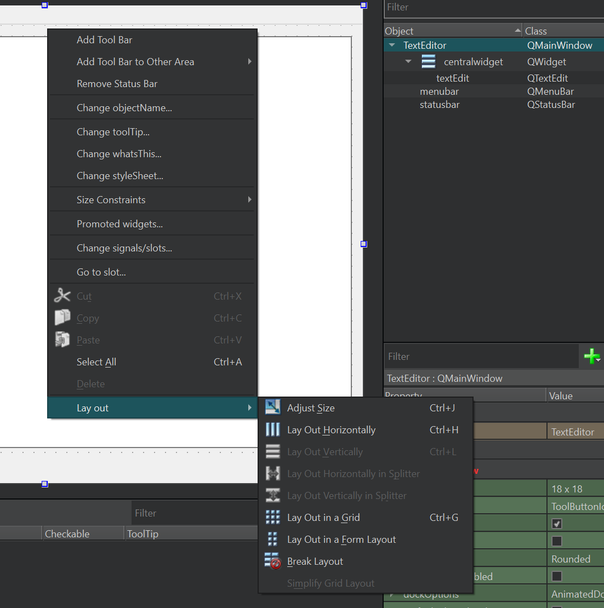
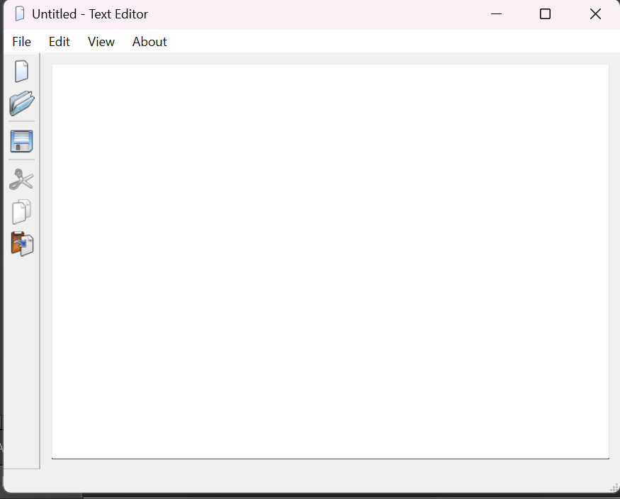
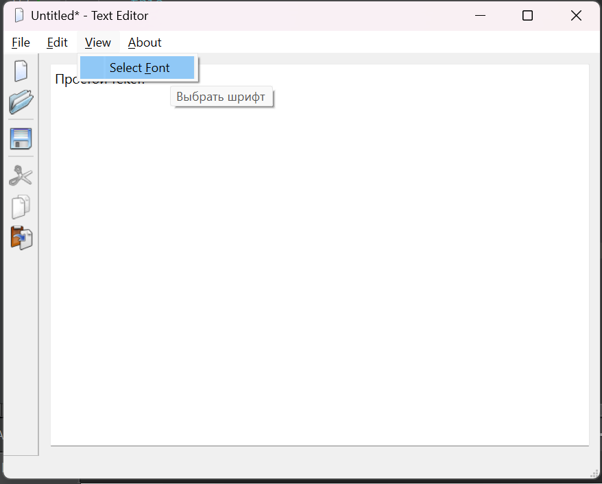
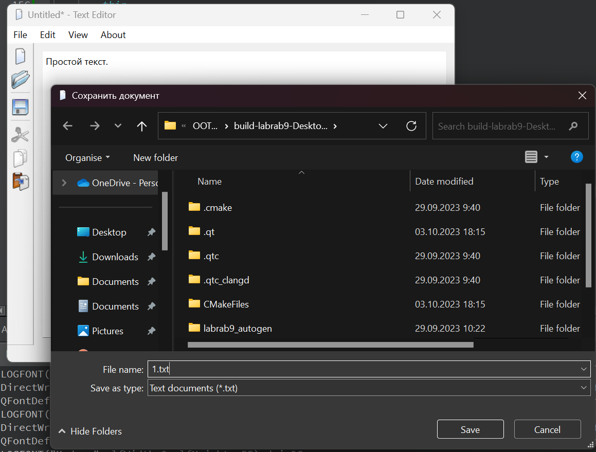
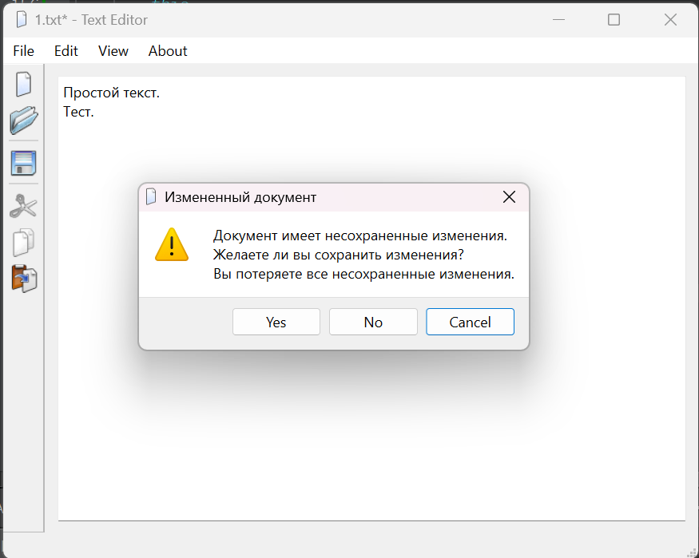

# Отчет по лабораторной работе №1

## Основы Qt

## Вариант №15

## Цель лабораторной работы

Эта лабораторная работа проведёт вас через все этапы построения законченного приложения на Qt. Целью является понимание структуры приложения на Qt и получение опыта использования стандартной документации Qt.

`Мисиюк Алексей Сергеевич (ПО-9)`

## Ход работы

Файлы проекта с кодом:

- [main.cpp](./main.cpp)
- [texteditor.h](./texteditor.h)
- [texteditor.cpp](./texteditor.cpp)

А также файл ресурсов:

- [texteditor.qrc](./texteditor.qrc)

### Главное окно редактора

После создания Qt проекта, а также файла ресурсов и скачивания иконок, переходим в Qt Designer. Добавляем QTextEdit на окно. Выбираем главное окно и выбираем Lay out -> Lay Out Verticaly. Как можно заметить, QTextEdit занимает всю доступную область. Дополнительно можно установить отступы по 10 пикселей, а также установить минимальный размер окну.



Создаем *набор инструментов* (*Add Tool Bar*). Помещаем его слева от редактора, в настройках выключаем возможность его перемещать.


Дальше создаются и добавляются в пункт меню **File** действия **New**, **Close** и **Exit**. Добавляем разделители между всеми пунктами и **&** перед каждой первой буквой для быстрого переключения на пункты ( с помощью **Alt + 'Key'** ). Также действие **New** помещаем на панель инструментов.

Теперь реализуем функционал действий.  
Для **New** на сигнал triggered() мы создаем новое окно TextEditor. Используя Qt Designer выбираем наш **actionNew** и в контекстном меню выбираем *Go to slots*, где выбираем нужный сигнал. Получаем функцию в которую пишем:

```c++
void TextEditor::on_actionNew_triggered()
{
    TextEditor* text_edit = new TextEditor();
    text_edit->show();
}
```

Для **Close** и **Exit** реализация сигналов уже существует. Поэтому в конструкторе соеденим слоты с сигналами:

```c++
TextEditor::TextEditor(QWidget *parent)
    : QMainWindow(parent)
    , ui(new Ui::TextEditor)
{
    ui->setupUi(this);

    setAttribute(Qt::WA_DeleteOnClose);
    connect(ui->actionClose, SIGNAL(triggered()), this, SLOT(close()));
    connect(ui->actionExit, SIGNAL(triggered()), qApp, SLOT(closeAllWindows()));
}
```

### Изменения в документе

Теперь будем отлавливать изменение документа.  
Для этого используем сигнал QTextEdit textChanged(). Cоздаем слот:

```c++
private slots:
    //...

    void documentChanged();
```

Соеденяем в конструкторе:

```c++
TextEditor::TextEditor(QWidget *parent)
// ...
{
    //...
    connect(ui->textEdit, SIGNAL(textChanged()), this, SLOT(documentChanged()));
}
```

И пишем реализацию. Тут мы установим свойство окна *windowMofidied* в true. В итоге, если в заголовке окна есть '**\***', то в заголовке измененного окна сможем увидеть эту звезду.

```c++
void TextEditor::documentChanged() {
    this->setWindowModified(true);
}
```

### Закрытие окна редактора

Сейчас делаем подтверждение при закрытии измененного окна.  
Для этого переопределяем событие закрытия окна, добавляем в .h прототип, в .cpp реализацию:

```c++
void TextEditor::closeEvent(QCloseEvent *e)
{
    if (!this->isWindowModified()) return e->accept();

    QMessageBox::StandardButton reply;
    reply = QMessageBox::warning(this,
            TextEditor::onCloseModifiedModalTitle,
            TextEditor::onCloseModifiedModalText,
            QMessageBox::Yes | QMessageBox::No);
    // Dont close window
    if (reply == QMessageBox::No) return e->ignore();

    // Close window
    e->accept();
}
```

### Выбор шрифта

Будем делать выбор шрифта, с его последующим сохранением.  
Сначала определим параметры для сохранения настроек приложения: название и версия приложения, название организации-производителя и домен.  
Также можем определить иконку для окна редактора.

```c++
int main(int argc, char *argv[])
{
    QApplication a(argc, argv);
    a.setApplicationName("Text Editor");
    a.setApplicationVersion("0.1");
    a.setOrganizationName("ExampleSoft");
    a.setOrganizationDomain("example.com");
    a.setWindowIcon(QIcon(":icons/src/new.png"));

    //...
}
```

Добавим действие на панель инструментов View -> Select Font. Добавим **&**-ы. Соеденяем сигнал triggered() с слотом и пишем реализацию. Вызов диалога выбора шрифта и установка его в QTextEdit, а также сохранение шрифта в настройки.

```c++
void TextEditor::on_actionSelectFont_triggered()
{
    QSettings settings;
    QFont initial = ui->textEdit->font();
    bool ok;
    QFont font = QFontDialog::getFont(
        &ok, initial, this);

    if (ok) {
        settings.setValue("viewFont", font);
        ui->textEdit->setFont(font);
    }
}
```

При создании окна редактора будем также загружать наш сохраненный шрифт. Значение по умолчанию не забудем.

```c++
TextEditor::TextEditor(QWidget *parent)
// ...
{
    //...

    QSettings settings;
    ui->textEdit->setFont( settings.value("viewFont", QApplication::font()).value<QFont>() );

    //...
}
```

### Правка и Справка

Будем делать действия для работы с буфером обмена (*Вырезать*, *Копировать* и *Вставить*) и дополнительно действия *Отменить* и *Повторить*. В качестве бонуса добавим действия *О программе* и *О Qt*. Не забудем комбинации клавиш и иконки.

Естественно добавляем **&** куда только можно. Для одинаковых **C**opy и **C**ut можно конечно выбрать и другую букву, но так тоже работать будет. Можно будет выбрать какой пункт при помощи повторых нажатий **C** и подтвердить клавишей **Enter**.

Справочные действия добавляем в пункт меню **About**. Остальные в пункт **Edit**. Также добавим сепаратор в пункте **Edit** между 2-мя группами действий.

Действия для работы с буфером обменом также помещаем на панель инструментов.

Соеденяем сигналы и слоты:

```c++
TextEditor::TextEditor(QWidget *parent)
    //...
{
    //...

    connect(ui->actionCut, SIGNAL(triggered()), ui->textEdit, SLOT(cut()));
    connect(ui->actionCopy, SIGNAL(triggered()), ui->textEdit, SLOT(copy()));
    connect(ui->actionPaste, SIGNAL(triggered()), ui->textEdit, SLOT(paste()));
    connect(ui->actionUndo, SIGNAL(triggered()), ui->textEdit, SLOT(undo()));
    connect(ui->actionRedo, SIGNAL(triggered()), ui->textEdit, SLOT(redo()));

    ui->actionCopy->setEnabled(false);
    ui->actionCut->setEnabled(false);
    ui->actionUndo->setEnabled(false);
    ui->actionRedo->setEnabled(false);
    connect(ui->textEdit, SIGNAL(copyAvailable(bool)), ui->actionCopy, SLOT(setEnabled(bool)));
    connect(ui->textEdit, SIGNAL(copyAvailable(bool)), ui->actionCut, SLOT(setEnabled(bool)));
    connect(ui->textEdit, SIGNAL(undoAvailable(bool)), ui->actionUndo, SLOT(setEnabled(bool)));
    connect(ui->textEdit, SIGNAL(redoAvailable(bool)), ui->actionRedo, SLOT(setEnabled(bool)));

    connect(ui->actionAboutQt, SIGNAL(triggered()), qApp, SLOT(aboutQt()));
}
```

Для действия *О программе* обработка будет такая:

```c++
void TextEditor::on_actionAbout_triggered()
{
    QMessageBox::about(this, TextEditor::onAboutdModalTitle, TextEditor::onAboutdModalText);
}
```

### Открытие файлов

Теперь, будем делать сохранение и открытие файлов в текстовом редакторе. Без этого не камельфо.

Добавим приватную строку *QString m_fileName*.  
Изменим конструктор:

```c++
TextEditor(const QString &fileName = QString(), QWidget *parent = 0);
```

Добавим 2 метода:

```c++
private:
    //...
    QString m_fileName;

    //...

    void loadFile(const QString &fileName);
    void setFileName(const QString &fileName = QString());
```

Если есть файл, *loadFile()* будет пытаться открыть его и вставить текст в QTextEdit. Вызывается в конце конструктора.  
*setFileName()* присваивает значение *m_fileName* и устанавливает значение заголовка окна редактора.

***loadFile()***:

```c++
void TextEditor::loadFile(const QString &fileName)
{
    if (fileName.isNull()) return setFileName();

    QFile file(fileName);
    if ( !file.open(QIODevice::ReadOnly | QIODevice::Text) ) {
        QMessageBox::warning(this, TextEditor::onFileOpenErrorModalTitle, TextEditor::onFileOpenErrorModalText);
        return setFileName();
    }

    QTextStream stream(&file);
    ui->textEdit->setText(stream.readAll());

    file.close();
    setFileName(fileName);
    this->setWindowModified(false);
}
```

***setFileName()***:

```c++
void TextEditor::setFileName(const QString &fileName)
{
    this->m_fileName = fileName;
    this->setWindowTitle( QString("%1[*] - %2")
            .arg( m_fileName.isNull()
                    ? TextEditor::newDocumentTitle
                    : QFileInfo(m_fileName).fileName())
            .arg(QApplication::applicationName())
    );
}
```

Добавляем новое действие **Open** с иконкой, комбинацией клавиш и нами любимым **&**.  
Добавляем обработку сигнала triggered():

```c++
void TextEditor::on_actionOpen_triggered()
{
    QString fileName = QFileDialog::getOpenFileName(
        this,
        TextEditor::onFileOpenModalTitle,
        QDir::currentPath(),
        TextEditor::fileDialogTextFilesFilter
    );

    if (fileName.isNull()) return;

    if (this->m_fileName.isNull() && !this->isWindowModified()) {
        loadFile(fileName);
    }
    else {
        TextEditor* text_editor = new TextEditor(fileName);
        text_editor->show();
    }
}
```

### Сохранение документов

А сейчас будет сохранение документов.  
Объявляем 2 слота:

```c++
private slots:
   //...

    bool saveFile();
    bool saveFileAs();
```

В *saveFileAs()* вызываем диалоговое окно, получаем файл (имя файла), вызываем *setFileName( fileName )* и вызываем *saveFile()*, возвращая значение *saveFile()*.

```c++
bool TextEditor::saveFileAs()
{
    QString fileName = QFileDialog::getSaveFileName(
        this,
        TextEditor::onSaveFileModalTitle,
        m_fileName.isNull()
            ? QDir::currentPath()
            : m_fileName,
        TextEditor::fileDialogTextFilesFilter
    );

    if (fileName.isNull()) return false;

    setFileName(fileName);
    return saveFile();
}
```

В *saveFile()* мы пытаемся записать изменения в файл. В случае успеха, выставляем свойство *setWindowModified* в *false*.

```c++
bool TextEditor::saveFile()
{
    if (this->m_fileName.isNull()) return saveFileAs();

    QFile file(this->m_fileName);

    if ( !file.open(QIODevice::WriteOnly | QIODevice::Text) ) {
        QMessageBox::warning(this, TextEditor::onFileOpenErrorModalTitle, TextEditor::onFileOpenErrorModalText);
        setFileName();
        return false;
    }

    QTextStream stream(&file);
    stream << ui->textEdit->toPlainText();

    file.close();
    this->setWindowModified(false);

    return true;
}
```

Создаем действия **Save** и **SaveAs**. Комбинации клавиш, иконки и конечно же **&**. Добавляем их в пункт меню **File** и отделим их сепаратором. Также добавим в панель инструментов действие **Save**.

Дальше связываем triggered() сигнал этих действий с нашими слотами, объявленными выше:

```c++
connect(ui->actionSave, SIGNAL(triggered()), this, SLOT(saveFile()));
connect(ui->actionSaveAs, SIGNAL(triggered()), this, SLOT(saveFileAs()));
```

### Закрытие окон +++

Финишная прямая. Теперь можно пояснить зачем нам функции *saveFile** возвращают *bool* значение.

В общем, при закрытии окна нужно предлагать сохранить документ. Поэтому переделаем функцию, реализующую поведение при закрытии редактора:

```c++
void TextEditor::closeEvent(QCloseEvent *e)
{
    if (!this->isWindowModified()) return e->accept();

    QMessageBox::StandardButton reply;
    reply = QMessageBox::warning(this,
                TextEditor::onCloseModifiedModalTitle,
                TextEditor::onCloseModifiedModalText,
                QMessageBox::Yes | QMessageBox::No | QMessageBox::Cancel,
                QMessageBox::Cancel
    );

    switch(reply)
    {
    case QMessageBox::Yes:
        if (saveFile()) {
            e->accept();
        }
        else {
            e->ignore();
        }
        break;
    case QMessageBox::No:
        e->accept();
        break;
    case QMessageBox::Cancel:
    default:
        e->ignore();
        break;
    }

}
```

## Пример работы программы

Скриншоты работы с текстовым редактором.

---



Внесли изменения, появилась звезда в заголовке окна.





Пункт меню **File**:


Сохранение документа:



Проверка в другом редакторе:


Попытка закрыть документ. По умолчанию *Cancel*. В этом случае будет выбрана опция *Yes*.



Снова открываем и смотрим на наличие во второй строке надписи

```txt
Просто текст.
Тест.
```


